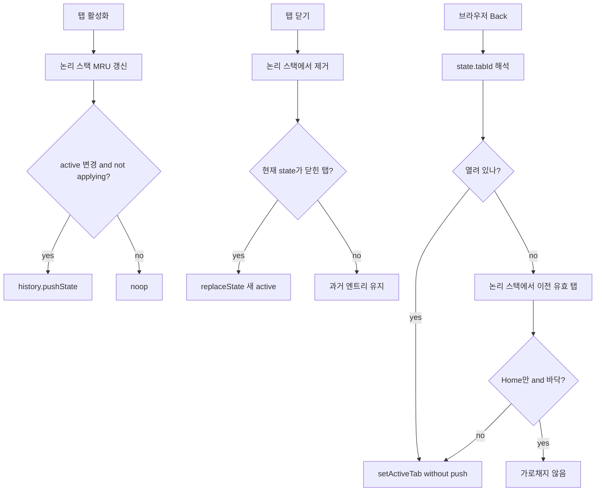

<!-- docs/mdi-history-bridge.md
MDI 탭 활성화와 브라우저 History(Back) 연동 설계안.
-->

# MDI ↔ Browser History 연동 설계안

상태: 설계 (미구현)  
대상: `apps/demo`  
작성일: 2026-08-06

## 목표 UX

- **Back**: 직전에 활성화했던 **열린** 탭으로 전환한다. 탭은 닫지 않는다.
- **Home만 남고 히스토리 바닥**이면 Back 시 **앱 밖**(이전 사이트/상위 URL)으로 나간다.
- 탭 **닫기** 시 논리 스택에서 제거하고, Back 중 닫힌 탭은 건너뛴다.

## 범위

| 포함 (v1) | 제외 (후속) |
|-----------|-------------|
| demo 탭 활성화/닫기 ↔ History | `@gen-office/mdi` 패키지 API 변경 |
| 활성화(MRU) 스택 기반 Back | 페이지 내부 list/detail Back |
| Home을 바닥으로 이탈 | 공유용 URL(`?page=`)과 History 양방향 동기화 |
| feature flag로 on/off | Forward UX 정교화 |

참고: Showcase MVP(`apps/showcase/docs/plan/07-mvp-decisions.md`)는 History 미사용이 확정이다. 이 설계는 **demo 제품 UX**용이며, showcase 빌드에서는 플래그로 끈다.

## 핵심 원칙

1. **논리 스택이 진실**: `activationStack: string[]` (최근 활성 탭 id, 중복 없이 MRU)
2. **브라우저 History는 신호**: 중간 엔트리 삭제 API가 없으므로 close 시 History splice를 시도하지 않는다.
3. **Back = 전환, Close ≠ Back**: Back으로 탭을 닫지 않는다.
4. **재진입 가드**: `popstate`로 `setActiveTab` 할 때 다시 `pushState`하지 않는다 (`isApplyingHistory`).

## 상태 모델

```ts
type MdiHistoryState = {
  v: 1;
  tabId: string; // 'home' | menuId
};

type MdiHistoryBridgeState = {
  activationStack: string[]; // [older ..., newest]
  isApplyingHistory: boolean;
};
```

- `activationStack` 끝 = 현재 활성 탭
- Home(`id: 'home'`, `closable: false`)은 항상 열려 있고 스택에 포함 가능하다.
- 동일 탭 재활성(이미 active) 시 **push하지 않는다** (중복 엔트리 방지).

## 이벤트 ↔ 동작



### 1. 활성화 시 (push)

트리거: `App.tsx`의 `handleOpenPage` / `handleOpenHome` / 탭 클릭으로 인한 `activeTabId` 변경.

연결 권장:

- demo에서 `useMDIStore.subscribe`로 `activeTabId` 변경 감지 → bridge `onActivated(tabId)`

`onActivated(tabId)`:

1. `isApplyingHistory`이면 push 생략
2. 스택 끝과 같으면 noop
3. 스택에서 기존 `tabId` 제거 후 끝에 추가 (MRU)
4. `history.pushState({ v: 1, tabId }, '', pathname + search)`  
   - v1에서 **URL은 변경하지 않음** (공유 URL 정책과 충돌 최소화)

### 2. 닫기 시 (논리 스택에서 제거)

트리거: TabBar close → `removeTab` 직후.

`onClosed(tabId, nextActiveTabId)`:

1. `activationStack = activationStack.filter((id) => id !== tabId)`
2. `history.state?.tabId === tabId`이면  
   `history.replaceState({ v: 1, tabId: nextActiveTabId }, '', url)`
3. 그 외 과거 History 칸은 방치한다 (Back 시 스킵)

브라우저 History에서는 중간 항목을 뺄 수 없다. **앱 논리 스택에서만 제거**하고, History 과거 칸은 `popstate`에서 무시한다.

### 3. Back 시 (popstate)

`onPopState(event)`:

1. `isApplyingHistory = true`
2. `candidate = event.state?.tabId`
3. 후보가 열린 탭이면 `setActiveTab(candidate)`
4. 아니면 `activationStack`을 끝에서부터 훑어 **아직 열린** 첫 탭으로 `setActiveTab`  
   - 논리 스택도 그에 맞게 정리
5. 유효 후보가 **Home뿐**이고 이번 pop이 **앱 진입 바닥**을 지나가는 경우 → 가로채지 않음
6. `isApplyingHistory = false`

### Home 바닥 규칙 (앱 밖 이탈)

초기 로그인 후 Home 탭 생성 시:

- `replaceState({ v: 1, tabId: 'home' })`로 **현재 칸만** Home으로 표시 (추가 칸 생성 금지)
- 이후 다른 탭 활성화만 `pushState`
- 스택이 `['home']`이고 현재 state도 home이면 Back → 브라우저 기본(앱 밖)

## 구현 배치 (착수 시)

| 모듈 | 역할 |
|------|------|
| `apps/demo/src/app/mdi-history/mdiHistoryBridge.ts` | 스택·push/replace/popstate·가드 |
| `apps/demo/src/app/mdi-history/useMdiHistoryBridge.ts` | mount 시 subscribe + popstate 등록 |
| `apps/demo/src/app/App.tsx` | 로그인 후 MDI 준비되면 hook 활성화 |
| feature flag | 예: `VITE_MDI_HISTORY=1` 또는 showcase 프로파일에서 off |

v1에서 `@gen-office/mdi`는 **수정하지 않는다**. close 시 `nextActiveTabId`는 `removeTab` 직후 store에서 읽으면 된다.

## 엣지 케이스

| 케이스 | 처리 |
|--------|------|
| 이미 열린 탭 재클릭 | active 불변 → push 없음 |
| 같은 탭을 과거에 여러 번 방문 | 논리 스택은 MRU 1개; History 과거 칸은 남을 수 있음 → popstate 스킵 |
| maxTabs로 add 실패 | push 없음 |
| closeAllClosableTabs | 스택을 열린 탭만 남기고 `replaceState(home)` |
| 로그아웃 | popstate 리스너 해제, 스택 클리어 |
| `href="#"` 등 해시 오염 | 링크는 `preventDefault` 유지 |
| Forward | 열린 탭이면 활성화, 닫혔으면 스킵 로직 재사용 |

## 검증 시나리오

1. Home → A → B, Back → A, Back → Home, Back → 앱 밖
2. Home → A → B, B 닫기 → A 활성, Back → Home (B 칸이 남아 있어도 스킵)
3. Home → A, A에서 탭 클릭으로 Home, Back → A
4. Home만 있는 상태에서 Back → 이탈
5. flag off 시 기존처럼 Back = 즉시 이탈 (Showcase 호환)

## 리스크 / 비목표

- History 중간 삭제 불가로 **Back 횟수 ≠ 열린 탭 수**가 될 수 있다 (스킵으로 UX 보정).
- 탭 전환마다 push하므로 긴 세션에서 History가 길어질 수 있다 → 동일 탭 재활성 no-push로 완화.
- 페이지 내부 상태(결재 list/detail 등)는 v1 비범위다. 함께 넣으면 탭 History와 이중 스택이 충돌한다.

## 관련 문서

- `docs/logs/decisions.md` — demo History 연동 결정
- `apps/showcase/docs/plan/07-mvp-decisions.md` — Showcase History 미사용 정책
- `docs/MDI_DEMO_GUIDE.md` — MDI demo 가이드
