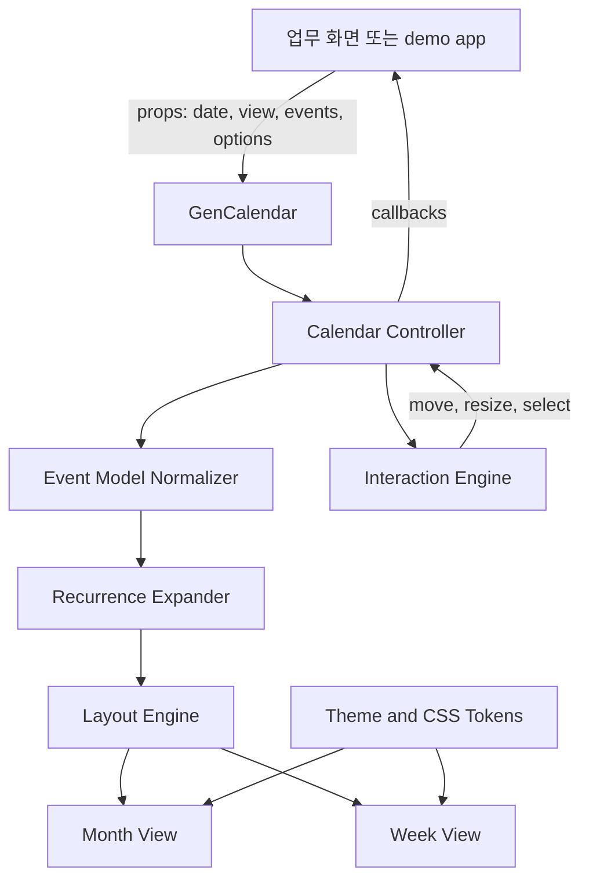
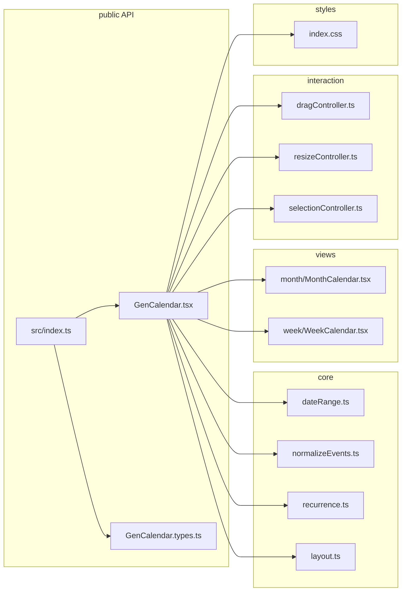
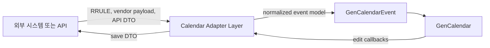
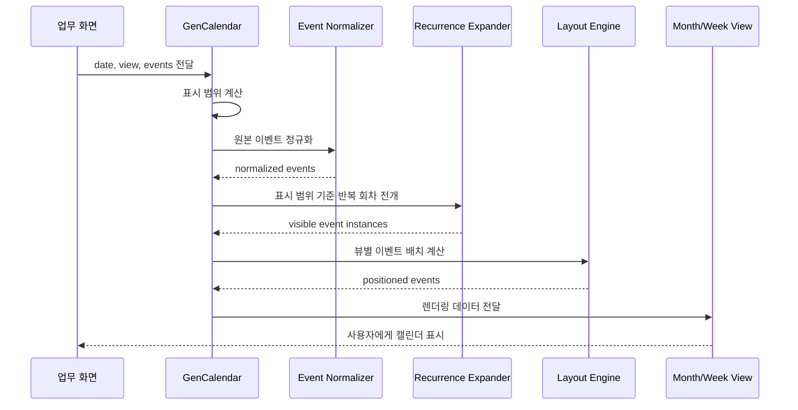
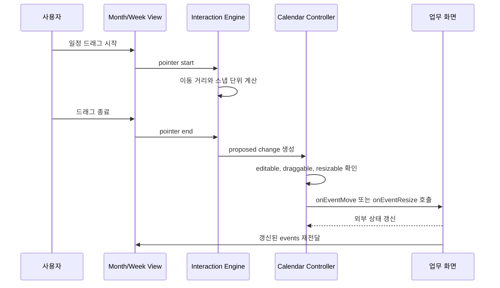
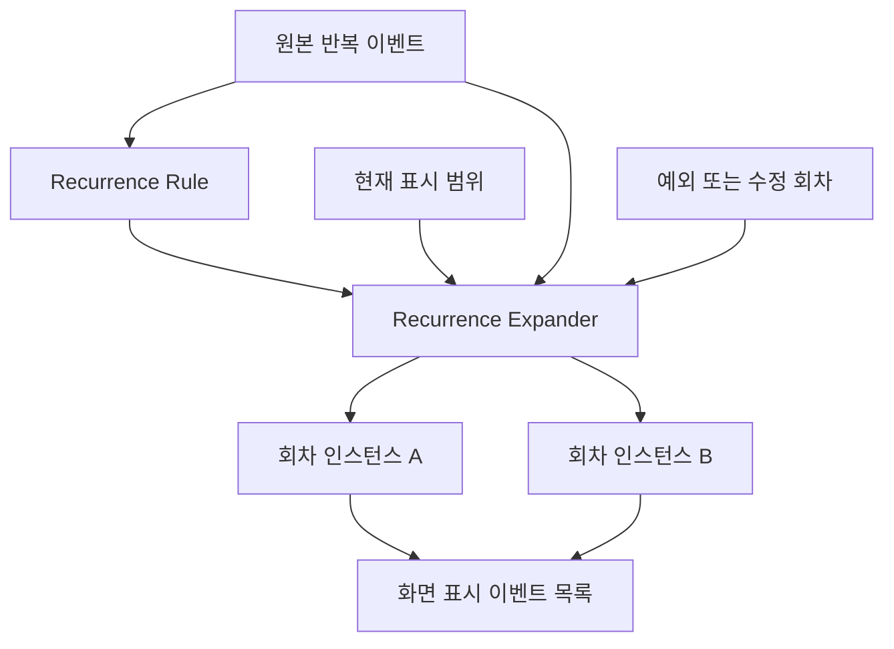
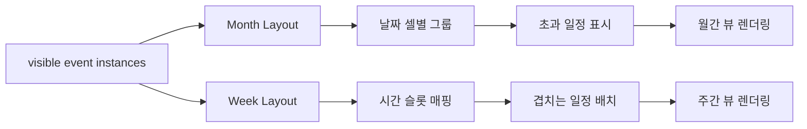

<!-- packages/gen-calendar/docs/calendar-architecture.md
Documents the proposed GenCalendar architecture using Mermaid diagrams.
-->

# GenCalendar 아키텍처 초안

## 목적

이 문서는 `@gen-office/gen-calendar`의 1차 구현 구조를 사람이 빠르게 이해할 수 있도록 정리한다.

1차 범위는 월간/주간 뷰, 편집 가능 캘린더, 드래그 기반 일정 이동 및 기간 변경, 반복 일정 허용이다. 고객별 저장, 승인, 권한, 충돌 처리 정책은 패키지 밖에서 담당하고, `gen-calendar`는 표시와 상호작용 결과를 안정적인 콜백 계약으로 전달하는 역할에 집중한다.

## 전체 구조



핵심 분리는 다음과 같다.

- `GenCalendar`: 외부 공개 React 컴포넌트다.
- `Calendar Controller`: controlled/uncontrolled 상태, 날짜 범위, 콜백 계약을 관리한다.
- `Event Model Normalizer`: 입력 이벤트를 내부 계산에 적합한 형태로 정규화한다.
- `Recurrence Expander`: 현재 표시 범위에 필요한 반복 회차를 만든다.
- `Layout Engine`: 월간/주간 뷰에서 이벤트 배치 좌표를 계산한다.
- `Interaction Engine`: 드래그 이동, 기간 변경, 슬롯 선택을 처리한다.
- `Month View`, `Week View`: 계산된 레이아웃을 렌더링한다.

## 패키지 내부 모듈 후보



초기에는 모듈을 너무 잘게 쪼개기보다, 날짜 계산과 반복 전개처럼 테스트 가치가 높은 순수 로직을 먼저 분리한다. React 뷰 계층은 월간/주간 뷰가 실제로 달라지는 지점부터 나눈다.

## 외부 시스템 연동 레이어

외부 캘린더나 다른 시스템과의 인터페이스가 필요할 때는 `GenCalendarEvent`와 `GenCalendarRecurrenceRule`을 패키지 내부 기준 모델로 유지하고, 중간 변환 레이어를 둔다.



이 구조는 외부 시스템의 반복 규칙, 필드명, 타임존 정책이 `gen-calendar` 공개 타입을 흔들지 않게 하기 위한 것이다.

## 데이터 흐름



원본 이벤트와 화면 표시 이벤트는 분리한다. 반복 일정은 하나의 원본 이벤트가 여러 표시 인스턴스로 확장될 수 있기 때문이다.

## 편집 상호작용 흐름



패키지는 편집 결과를 직접 저장하지 않는다. `onEventMove`, `onEventResize` 같은 콜백으로 제안된 변경 결과를 전달하고, 업무 화면이 서버 저장과 상태 갱신을 담당한다.

## 반복 일정 모델



반복 일정은 다음 원칙을 따른다.

- `recurrence`가 있는 이벤트는 반복 원본이다.
- `recurrenceId`와 `originalStart`가 있는 이벤트는 특정 반복 회차의 수정 또는 예외를 나타낸다.
- 현재 표시 범위 밖의 반복 회차는 렌더링을 위해 전개하지 않는다.
- 서버가 이미 전개한 이벤트 목록을 내려주는 경우에도 표시할 수 있어야 한다.

## 뷰별 책임



월간 뷰는 날짜별 그룹과 초과 일정 표시가 핵심이다. 주간 뷰는 시간 슬롯, 겹치는 일정 배치, 드래그 스냅 단위가 핵심이다.

## 외부 콜백 계약 후보

```ts
interface GenCalendarEditChange {
  eventId: string;
  start: string;
  end: string;
  allDay?: boolean;
  originalEvent: GenCalendarEvent;
}

interface GenCalendarSlotSelection {
  start: string;
  end: string;
  allDay?: boolean;
  view: GenCalendarView;
}
```

```tsx
<GenCalendar
  onSlotSelect={(selection) => {}}
  onEventMove={(change) => {}}
  onEventResize={(change) => {}}
/>
```

콜백은 “변경 제안”을 전달한다. 실제 반영 여부, 저장 실패 처리, 충돌 검사는 업무 화면이 담당한다.

## 1차 검증 포인트

- 월간 날짜 매트릭스가 월 시작 요일과 이전/다음 달 날짜를 올바르게 포함하는지 확인한다.
- 주간 표시 범위가 기준 날짜의 주 시작/종료를 올바르게 계산하는지 확인한다.
- 반복 일정이 표시 범위 안에서만 전개되는지 확인한다.
- 반복 회차 예외가 원본 반복 일정보다 우선되는지 확인한다.
- 주간 뷰에서 겹치는 일정의 위치와 너비가 안정적으로 계산되는지 확인한다.
- 드래그 이동과 기간 변경이 스냅 단위에 맞게 콜백을 호출하는지 확인한다.

## 확정된 아키텍처 결정

- 반복 일정은 `GenCalendarRecurrenceRule` 구조화 타입을 우선 사용한다.
- RRULE 등 외부 규칙은 어댑터 레이어에서 변환한다.
- 드래그 편집의 기본 스냅 단위는 30분이다.
- 주간 뷰는 24시간 전체를 기본 표시 범위로 한다.
- 자체 구현을 우선하되, 날짜/반복 전개처럼 검증 부담이 큰 부분은 순수 함수와 테스트로 분리한다.
- 월간 초과 일정 클릭은 `onMoreEventsClick` 콜백을 우선 제공한다.

## 남은 결정

- (해소) 패키지 이름: `@gen-office/gen-calendar`
- (해소) 문서 디렉터리: `docs/`
- (해소) 연동: Storybook + demo
- (해소) 월간 초과 일정 예제: demo 우측 패널
