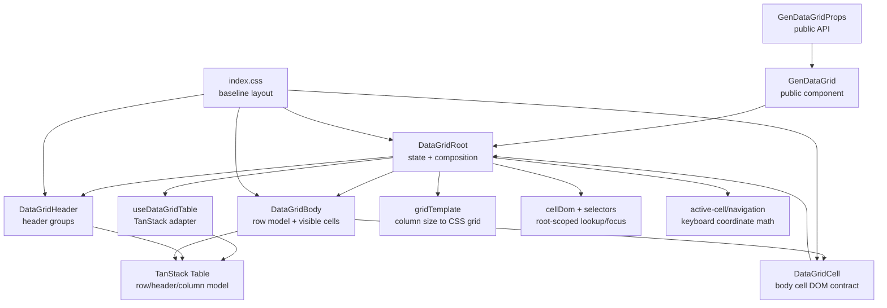
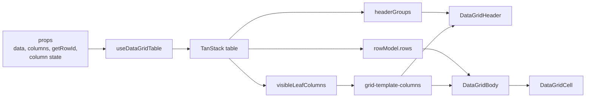
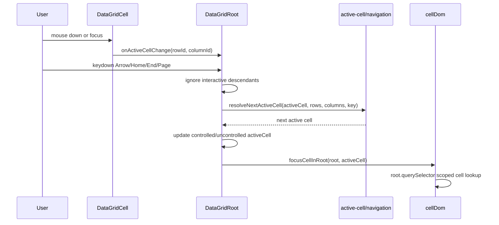

<!-- packages/gen-datagrid/docs/architecture/gate-1-2-architecture.md
Documents the Gate 1 and Gate 2 GenDataGrid component relationships and data flow.
-->

# GenDataGrid Gate 1-2 Architecture

This document describes the current architecture after Phase 1 and Gate 2 baseline work.

## Component Relationship

## Render Data Flow

## Interaction Flow

## Current Boundaries

- `GenDataGrid` is the public entry point and delegates rendering to `DataGridRoot`.
- `DataGridRoot` owns composition, active cell state, keyboard handling, grid id resolution, and root-scoped focus.
- `useDataGridTable` is the Phase 1 adapter between public props and TanStack table state/model.
- `DataGridHeader` and `DataGridBody` consume TanStack models instead of raw `columns` and `data`.
- `DataGridCell` owns the body cell DOM contract and activation event.
- DOM lookup must remain root-scoped through `cellDom` and `selectors`; global `document.querySelector` is not allowed for cell focus.

## Implemented State Surface

- `activeCell`, `defaultActiveCell`, `onActiveCellChange`
- `columnOrder`, `defaultColumnOrder`, `onColumnOrderChange`
- `columnVisibility`, `defaultColumnVisibility`, `onColumnVisibilityChange`
- `columnSizing`, `defaultColumnSizing`, `onColumnSizingChange`
- `rowHeight`, `getRowHeight` for non-virtualized rendering

## Not Yet Implemented

- Range selection and clipboard
- Editing lifecycle
- Column pinning, resize handles, and reorder UI
- Filtering, footer, pagination, and dirty state
- Row virtualization
- Playwright or Storybook test runner browser automation
