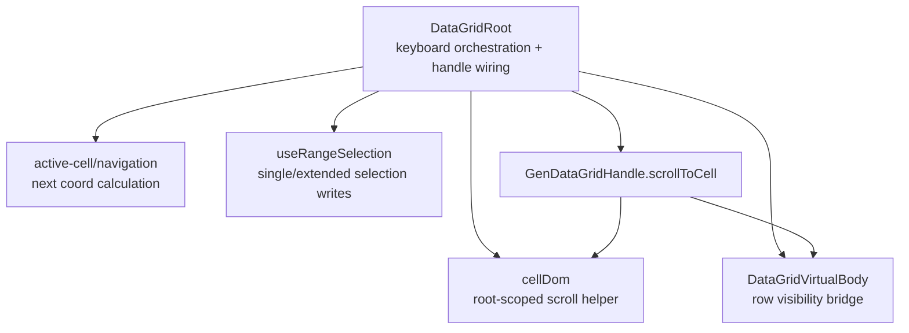

<!-- packages/gen-datagrid/docs/architecture/gate-3-1-keyboard-selection-architecture.md
Documents the Gate 3.1 keyboard selection and scroll handle follow-up.
-->

# GenDataGrid Gate 3.1 Keyboard Selection Architecture

Gate 3.1 extends the Gate 2 active-cell keyboard model and the Gate 3 range selection model without changing their core state contracts.

## Implemented Slice

- `Shift + Arrow`, `Shift + Home`, `Shift + End`, `Shift + PageUp`, and `Shift + PageDown` extend the current range selection from a stable anchor while still moving `activeCell`.
- Plain keyboard navigation still collapses selection back to the navigated cell.
- The last range selection remains the keyboard-owned range. Repeated `Shift` navigation keeps reusing that range's anchor.
- If no range exists yet, keyboard range extension uses the current `activeCell` as the anchor.
- `GenDataGridHandle.scrollToCell(coord)` scrolls the requested cell into view without changing `activeCell` or selection state.
- Virtualized grids bridge `scrollToCell(coord)` through the existing virtual row scroll path before retrying root-scoped cell scrolling.

## Component Relationship

## Keyboard Selection Contract

- Plain navigation:
  - move `activeCell`
  - replace selection with the destination cell
- `Shift` navigation:
  - move `activeCell`
  - preserve the existing range anchor
  - update only the range focus to the destination cell

This keeps mouse and keyboard selection behavior aligned around the same `{ anchor, focus }` model.

## Scroll Handle Contract

- `scrollToCell(coord)` is imperative visibility control only.
- It does not focus the cell.
- It does not mutate `activeCell`.
- It does not change selected ranges.
- For non-virtualized grids it uses root-scoped cell lookup and native nearest scrolling.
- For virtualized grids it first scrolls the target row into the rendered window, then retries the cell-level scroll on the next animation frame.
