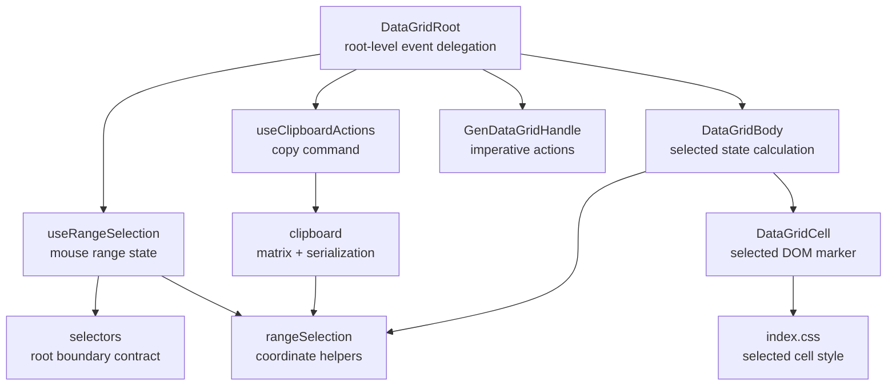
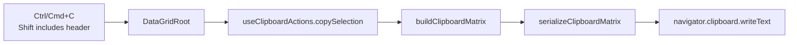
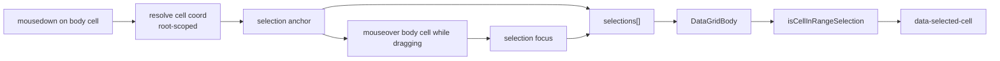
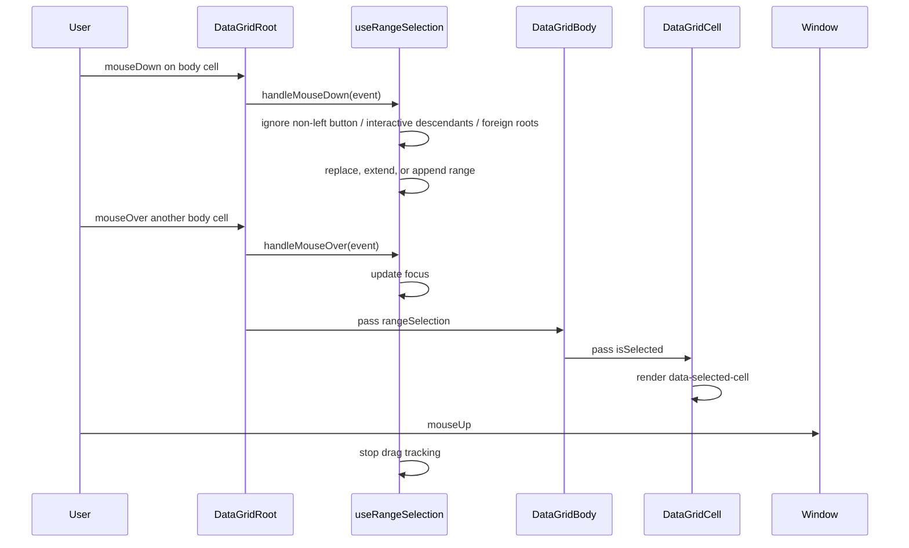

<!-- packages/gen-datagrid/docs/architecture/gate-3-architecture.md
Documents the Gate 3 range selection architecture for GenDataGrid.
-->

# GenDataGrid Gate 3 Architecture

용어 기준: Active Cell, Selected Cell, Range Selection, Anchor Cell, Focus Cell, Copy Selection은 `../reference/terminology.md`를 따른다.

This document describes the current Gate 3 range selection and clipboard slice. Plain-text paste application was added in Gate 4.2; paste-to-selection remains deferred.

## Component Relationship

## Clipboard Copy Flow

## Selection Data Flow

## Interaction Flow

## Current Boundaries

- Range selection starts only from body cells inside the current grid root.
- Interactive descendants such as `input`, `select`, `textarea`, `button`, and `contenteditable` do not start range selection.
- Selection supports controlled and uncontrolled state through `selectedRanges`, `defaultSelectedRanges`, and `onSelectedRangesChange`.
- Normal mouse selection replaces existing ranges.
- Shift selection extends the last range from its anchor.
- `Shift` keyboard navigation extends the last range from its anchor while moving `activeCell`.
- Ctrl/Meta selection appends a separate range.
- Selection rendering uses per-cell `data-selected-cell="true"` markers.
- Active cell state remains separate from range selection state.
- `Ctrl/Cmd+C` copies the current focused grid selection.
- `Shift+Ctrl/Cmd+C` includes visible column headers in copied text.
- `Escape`, root empty area click, and `clearSelection()` clear selected ranges.
- Plain-text paste application (Gate 4.2) via root-level `paste` and `pasteOptions`.

## Implemented State Surface

- `GenDataGridRangeSelections`
- `selectedRanges`
- `defaultSelectedRanges`
- `onSelectedRangesChange`
- `selection.anchor`
- `selection.focus`
- multiple internal ranges for Ctrl/Meta additive selection
- `data-selected-cell` DOM marker
- `enableRangeSelection`
- `enableClipboard`
- `clipboardOptions.includeHeader`
- `GenDataGridHandle.rootElement`
- `GenDataGridHandle.clearSelection()`
- `GenDataGridHandle.copySelection(options)`

## Deferred Features

- Paste-to-selection and paste type coercion
- Selection overlay for complex pinned/virtualized layouts
