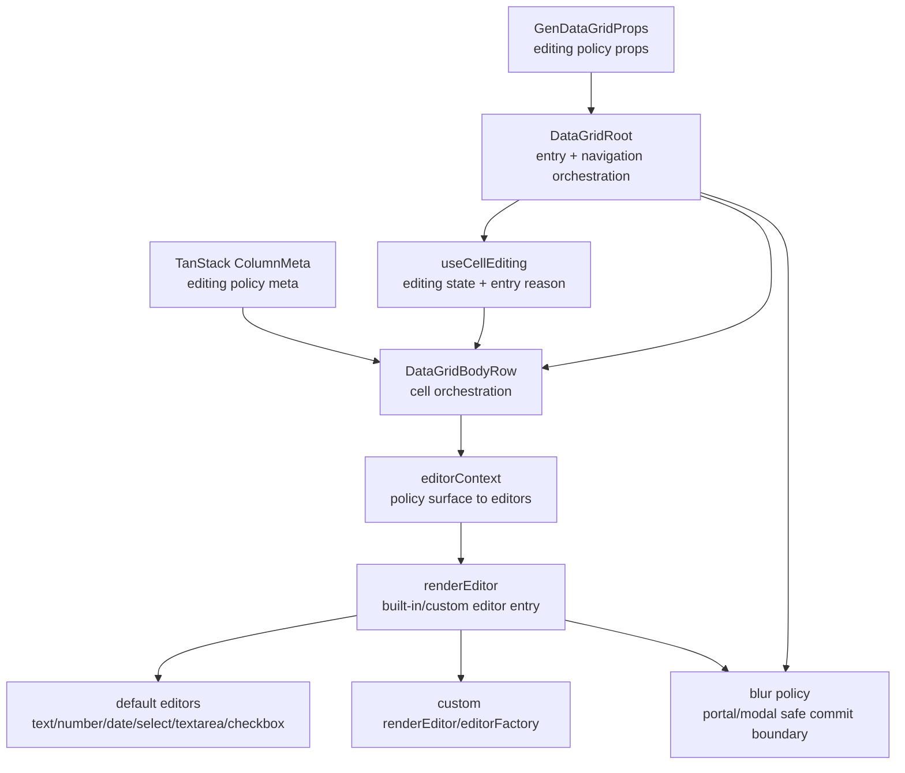

<!-- packages/gen-datagrid/docs/architecture/gate-4-1-editing-policy-architecture.md
Documents the Gate 4.1 editing policy follow-up for GenDataGrid.
-->

# GenDataGrid Gate 4.1 Editing Policy Architecture

Gate 4.1 completes the deferred editing-policy slice that sits on top of the existing Gate 4 editing runtime. The goal is to make edit entry, editor opening, navigation while editing, and blur/portal behavior explicit and testable.

## Scope

- printable-key edit entry
- `editOnActiveCell`
- `keepEditingOnNavigate`
- open-on-edit-start behavior for built-in and custom editors
- advanced blur / portal / modal editor commit policy

Gate 4.1 does not include paste application itself. Paste-to-edit integration remains part of Gate 4.2.

## Component Relationship

## Policy Surface

Recommended Gate 4.1 policy axes:

- entry reason:
  - keyboard command
  - printable key
  - active-cell activation
  - mouse reclick / double-click
- editor opening:
  - manual open
  - open on edit start
- navigation while editing:
  - commit and move
  - cancel and move
  - keep editing across navigation
- blur ownership:
  - inline blur commit
  - portal-safe blur ignore
  - modal-owned lifecycle

## Built-in Editor Expectations

- `text`, `number`, `textarea`
  - fully support printable-key entry
  - fully support select-on-focus and keep-editing navigation rules
- `select`
  - supports open-on-edit-start
  - requires blur policy that does not immediately close on menu ownership changes
- `date`
  - supports edit entry and commit/cancel policy
  - native browser date popup opening is browser-dependent and should be treated as manual visual verification unless a custom datepicker editor is used
- `checkbox`
  - participates in edit entry and navigation policy
  - does not require a popover-open contract

## Custom Editor Contract

Custom editors should receive enough context to decide whether they should open a popover or modal immediately on mount.

Recommended additions to editor context:

- `editEntryReason`
- `openOnEditStart`
- `keepEditingOnNavigate`
- blur ownership hints for portal/modal editors

This keeps built-in and custom editors on one policy surface instead of creating separate runtime paths.

## Test Strategy

### Automated

- printable-key edit entry state transition
- `editOnActiveCell` activation behavior
- `keepEditingOnNavigate` behavior across Arrow/Tab navigation
- `openOnEditStart` signal propagation to built-in and custom editors
- blur commit / cancel behavior for inline editors
- portal-safe ignore behavior through explicit editor hooks or test doubles

### Storybook Manual

- built-in `text`, `number`, `textarea`
- built-in `select`
- built-in `date`
- custom popover editor
- custom modal editor

Native browser `date` popup visibility should be treated as manual verification, not jsdom-level automation.
