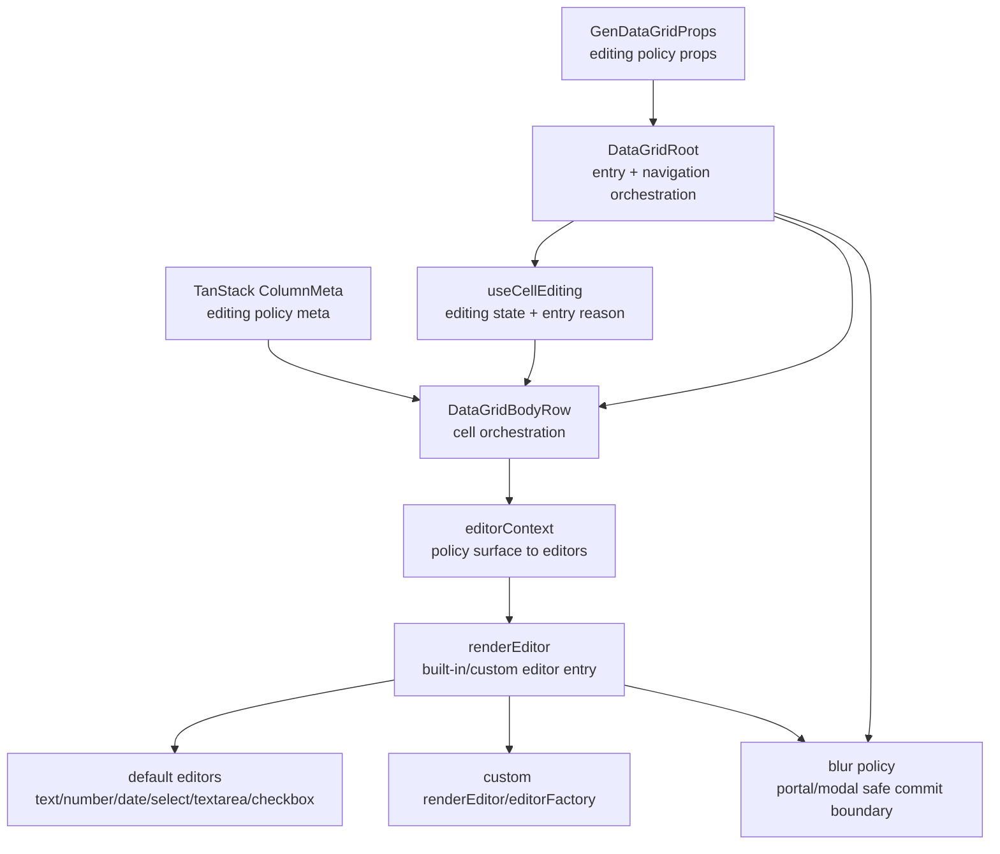

<!-- packages/gen-datagrid/docs/architecture/gate-4-1-editing-policy-architecture.md
Documents the Gate 4.1 editing policy follow-up for GenDataGrid.
-->

# GenDataGrid Gate 4.1 Editing Policy Architecture

Gate 4.1 completes the deferred editing-policy slice that sits on top of the existing Gate 4 editing runtime. The goal is to make edit entry, editor opening, navigation while editing, and blur/portal behavior explicit and testable.

## Scope

- printable-key edit entry
- `editOnActiveCell`
- built-in editor navigation policy while editing
- open-on-edit-start behavior for built-in and custom editors
- advanced blur / portal / modal editor commit policy

Gate 4.1 does not include paste application itself. Paste-to-edit integration remains part of Gate 4.2.

## Component Relationship



## Policy Surface

Recommended Gate 4.1 policy axes:

- entry reason:
  - keyboard command
  - printable key
  - active-cell activation
  - mouse reclick / double-click
- editor opening:
  - manual open
  - open on edit start
- navigation while editing:
  - commit and move
  - cancel and move
  - keep editing across navigation
- blur ownership:
  - inline blur commit
  - portal-safe blur ignore
  - modal-owned lifecycle

## Gate 4.1-b Agreed Design

### Public API shape

```ts
type GenDataGridEditStartTriggers = {
  reclick?: boolean;
  doubleClick?: boolean;
  enter?: boolean;
  f2?: boolean;
  printableKey?: boolean;
};

type GenDataGridEditContinuationTriggers = {
  click?: boolean;
  tab?: boolean;
  arrowKey?: boolean;
};

type GenDataGridEditPolicy = {
  startTriggers?: GenDataGridEditStartTriggers;
  continueTriggers?: GenDataGridEditContinuationTriggers;
  openOnEditStart?: boolean;
};
```

- grid-level: `editPolicy?: GenDataGridEditPolicy`
- column-level: `meta.editPolicy?: GenDataGridEditPolicy`
- resolution: column override first, then grid default, then internal defaults

### Agreed default behavior

- `startTriggers`
  - `reclick: true`
  - `doubleClick: true`
  - `enter: true`
  - `f2: true`
  - `printableKey: true`
- `continueTriggers`
  - `click: false`
  - `tab: true`
  - `arrowKey: false`
- `openOnEditStart: false`

### Trigger semantics

- `reclick`
  - click on the already active cell
- `doubleClick`
  - independent double-click entry trigger
  - should remain logically separate from `reclick`
- `continueTriggers`
  - evaluated when editing is already active and focus/active-cell movement targets another cell
  - `click`, `tab`, and `arrowKey` share the same continuation meaning: whether the destination cell should immediately re-enter editing

### Continuation behavior

- previous editing cell defaults to `commit` before moving
- if the destination cell is not editable, move `activeCell` only
- when continuation enters the next editable cell, `openOnEditStart` applies the same way as any other edit-start path

### Open-on-edit-start scope

- Gate 4.1-b keeps `openOnEditStart` as a boolean only
- grid default and column override are both supported
- intended primarily for popup-style editors such as `select`, datepicker, and modal-based custom editors
- trigger-specific open policies are deferred until a later follow-up

## Gate 4.1-b Implementation Order

1. Add `GenDataGridEditPolicy` public types and TanStack column meta support.
2. Resolve merged edit policy in the editing runtime from grid props and column meta.
3. Apply `startTriggers` to mouse and keyboard edit-entry paths.
4. Apply `continueTriggers` to edit-preserving `click` / `Tab` / Arrow navigation.
5. Propagate `openOnEditStart` through built-in and custom editor context.
6. Add Storybook and interaction coverage for grid default, column override, and continuation behavior.

## Gate 4.1-b Completion

Gate 4.1-b is complete.

Implemented in this slice:

- public `editPolicy` API on grid props and TanStack column meta
- merged runtime edit policy resolution with grid default and column override precedence
- start-trigger gating for:
  - `reclick`
  - `doubleClick`
  - `enter`
  - `f2`
  - `printableKey`
- continuation-trigger handling for:
  - `click`
  - `tab`
  - `arrowKey`
- continuation defaults:
  - previous cell commits before movement
  - non-editable destination becomes active-only
  - selection collapses to the destination cell
  - destination editor receives focus when editing continues
- `openOnEditStart` propagation to built-in and custom editors
- built-in open-on-start attempt for native `select` and native `date`

Validated in this slice:

- interaction regression coverage through `pnpm -C frontend/packages/gen-datagrid test`
- manual Storybook verification with `Gate41BEditPolicy`

Known limitation kept for follow-up:

- native browser `select` popup visibility is not guaranteed from programmatic open attempts and may require a custom popup editor for production-grade immediate-open behavior
- textarea-specific Arrow-key editing ergonomics remain a later navigation-policy concern

## Built-in Editor Expectations

- `text`, `number`, `textarea`
  - fully support printable-key entry
  - fully support select-on-focus and keep-editing navigation rules
- `select`
  - supports open-on-edit-start
  - requires blur policy that does not immediately close on menu ownership changes
- `date`
  - supports edit entry and commit/cancel policy
  - native browser date popup opening is browser-dependent and should be treated as manual visual verification unless a custom datepicker editor is used
- `checkbox`
  - participates in edit entry and navigation policy
  - does not require a popover-open contract

## Gate 4.1-c Navigation Policy

Gate 4.1-c is intentionally narrower than the original placeholder wording. This slice does not introduce popup-editor infrastructure by itself. Instead, it locks the keyboard ownership policy for the built-in editors that already exist in the runtime.

### Built-in editor key ownership

- `text`, `number`, `date`
  - Arrow keys: grid navigation ownership
  - `Tab` / `Shift+Tab`: commit and move
  - `Enter`: commit
  - `Escape`: cancel
- `textarea`
  - Arrow keys: editor-local caret movement
  - `Tab` / `Shift+Tab`: commit and move
  - `Enter`: newline
  - `Escape`: cancel
- `select`
  - Arrow keys: editor-first ownership
  - `Tab` / `Shift+Tab`: commit and move
  - `Enter`: confirm / commit
  - `Escape`: close or cancel according to native control behavior
- `checkbox`
  - Arrow keys: grid navigation ownership
  - `Tab` / `Shift+Tab`: commit and move
  - `Enter`: commit / toggle contract defined by the current built-in runtime
  - `Escape`: cancel

### Scope boundary

- Gate 4.1-c does not yet define a separate popup-editor lifecycle.
- custom popover, datepicker, dropdown, and modal editors will reuse the same policy categories later, but their concrete focus/blur ownership remains part of Gate 4.1-d or a later popup-editor slice.
- textarea is the main built-in exception and must keep editor-local Arrow and Enter behavior even when other built-in editors continue to prefer grid-owned Arrow navigation.

## Gate 4.1-c Completion

Gate 4.1-c is complete.

Implemented in this slice:

- `builtinEditorKeyboard.ts` centralizes built-in editor keyboard ownership
- `textarea` and `select` keep Arrow keys editor-local
- `text`, `number`, `date`, and `checkbox` keep Arrow keys on grid navigation
- `textarea` Enter keeps newline behavior instead of commit
- `select` Enter commits; Escape cancels through the shared editor cancel path

Validated in this slice:

- unit coverage in `test/builtinEditorKeyboard.test.ts`
- interaction coverage for textarea/select Arrow ownership and select Enter commit
- manual Storybook verification with `Gate41CEditNavigation`

Known limitation kept for follow-up:

- native `select` Escape close semantics remain browser-dependent; production-grade popup editors may still need Gate 4.1-d or a custom popup editor slice

## Custom Editor Contract

Custom editors should receive enough context to decide whether they should open a popover or modal immediately on mount.

Recommended additions to editor context:

- `editEntryReason`
- `openOnEditStart`
- `keepEditingOnNavigate`
- blur ownership hints for portal/modal editors

This keeps built-in and custom editors on one policy surface instead of creating separate runtime paths.

## Test Strategy

### Automated

- printable-key edit entry state transition
- `editOnActiveCell` activation behavior
- built-in editor navigation policy across Arrow/Tab/Enter/Escape
- `openOnEditStart` signal propagation to built-in and custom editors
- blur commit / cancel behavior for inline editors
- portal-safe ignore behavior through explicit editor hooks or test doubles

### Storybook Manual

- built-in `text`, `number`, `textarea`
- built-in `select`
- built-in `date`
- custom popover editor
- custom modal editor

Native browser `date` popup visibility should be treated as manual verification, not jsdom-level automation.
