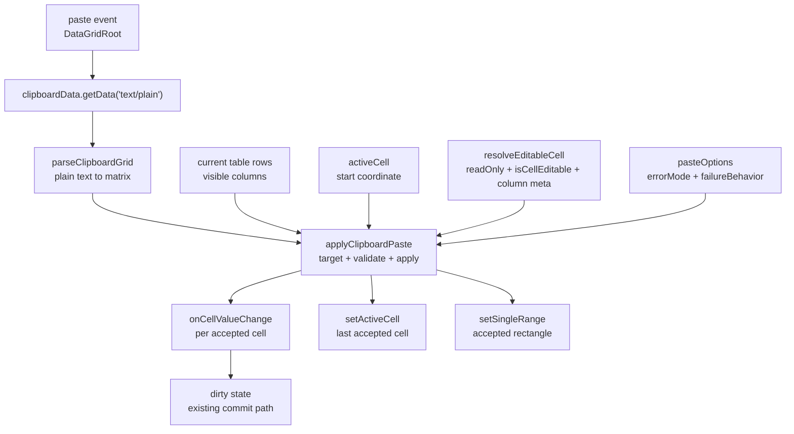
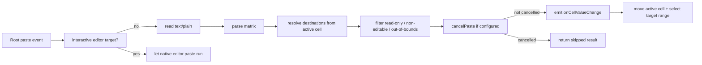

<!-- packages/gen-datagrid/docs/architecture/gate-4-2-clipboard-paste-architecture.md
Documents the Gate 4.2 clipboard paste architecture for GenDataGrid.
-->

# GenDataGrid Gate 4.2 Clipboard Paste Architecture

Gate 4.2 adds grid-level paste application on top of the Gate 4 editing runtime and Gate 4.1 editing policy. The feature turns plain-text clipboard data into committed cell change events without changing GenDataGrid data ownership.

## Scope

- root-level paste event handling
- plain-text clipboard matrix parsing
- active-cell based paste targeting
- editable/read-only filtering through the existing editing predicate
- optional paste error reporting and whole-paste cancellation
- active-cell and range-selection feedback after accepted paste

Gate 4.2 does not introduce row creation, typed value coercion, batch mutation ownership, or HTML/rich clipboard style import.

## Component Relationship



## Runtime Flow



## Current Rules

- Paste is enabled through the existing clipboard feature surface.
- The root paste handler reads only `event.clipboardData.getData('text/plain')`.
- Paste events from interactive editor elements are ignored so native input paste still works.
- Paste starts at the current `activeCell`, not at the DOM event target.
- Destination columns are the current visible column order.
- Destination rows are the current table row model.
- GenDataGrid never mutates `data` directly during paste.
- Each accepted cell emits one `onCellValueChange` event.
- Existing dirty-state tracking observes paste through the normal cell change path.
- `readOnly`, `readonly`, `isCellEditable`, and column editable metadata are respected.
- Non-editable, read-only, and out-of-bounds destinations are collected as paste errors.
- Default failure behavior is `skipCell`.
- `pasteOptions.failureBehavior: 'cancelPaste'` prevents all candidate changes when any paste error exists.
- Default error mode is `silent`.
- `pasteOptions.errorMode: 'report'` calls `pasteOptions.onError(errors)` when errors exist.
- After accepted paste, the active cell moves to the last accepted cell.
- When range selection is enabled, the accepted paste rectangle replaces the current selected range.

## Public API Surface

```ts
type GenDataGridPasteErrorReason =
  | 'readOnly'
  | 'nonEditableCell'
  | 'outOfBounds'
  | 'parseError'
  | 'validationError';

type GenDataGridPasteError = {
  reason: GenDataGridPasteErrorReason;
  rowId?: string;
  columnId?: string;
  rowIndex?: number;
  columnIndex?: number;
  value?: string;
};

type GenDataGridPasteOptions = {
  errorMode?: 'silent' | 'report';
  failureBehavior?: 'skipCell' | 'cancelPaste';
  onError?: (errors: GenDataGridPasteError[]) => void;
};
```

`pasteOptions` is intentionally narrow. It controls error visibility and failure behavior only. Value validation, value coercion, batch paste callbacks, undo transactions, and row creation remain outside this slice.

## Internal Apply Contract

`applyClipboardPaste` receives the parsed matrix, current rows, current visible columns, active cell, editability policy, paste options, and commit callbacks. It returns an internal result:

```ts
type GenDataGridPasteApplyResult = {
  appliedCellCount: number;
  skippedCellCount: number;
  targetRange: {
    anchor: { rowId: string; columnId: string };
    focus: { rowId: string; columnId: string };
  } | null;
};
```

The result is used by `DataGridRoot` to decide whether to prevent the browser default paste behavior and to update visual feedback.

## Selection Feedback

Paste selection feedback uses a single range replacement:

- the target range is calculated from accepted candidates only
- sparse accepted candidates still produce a bounding rectangle
- `setSingleRange(targetRange)` replaces the previous range in one operation

The one-operation replacement matters for controlled `selectedRanges`. A two-step update such as setting the anchor first and then extending can accidentally reuse the previous controlled anchor.

## Error Policy

| Condition | Default behavior | With `errorMode: 'report'` | With `failureBehavior: 'cancelPaste'` |
|---|---|---|---|
| non-editable cell | skip cell | report error | cancel all candidates |
| read-only cell/grid | skip cell | report error | cancel all candidates |
| out of bounds | skip cell | report error | cancel all candidates |
| parse error | no apply | report error | no apply |

The grid does not render error UI directly. Applications that need visible error handling should use `pasteOptions.onError` and render their own notification or validation surface.

## Testing Strategy

Automated coverage should include:

- parser behavior for spreadsheet-style tab/newline text
- root paste application into editable cells
- native editor paste bypass
- non-editable cell skip behavior
- `errorMode: 'report'`
- `failureBehavior: 'cancelPaste'`
- active cell movement to the last accepted cell
- selected range replacement after paste, including controlled selection regression

Manual Storybook coverage is provided by `Gate42ClipboardPaste`.

## Deferred Features

- HTML/rich clipboard table import
- style import from Excel or browser tables
- typed value coercion for number/date/checkbox/select
- per-column paste parser or validator
- batch paste callback / transaction API
- undo/redo integration for paste batches
- row creation when pasted matrix exceeds current rows
- selection-repeat fill behavior
- server-side/manual pagination paste policy
