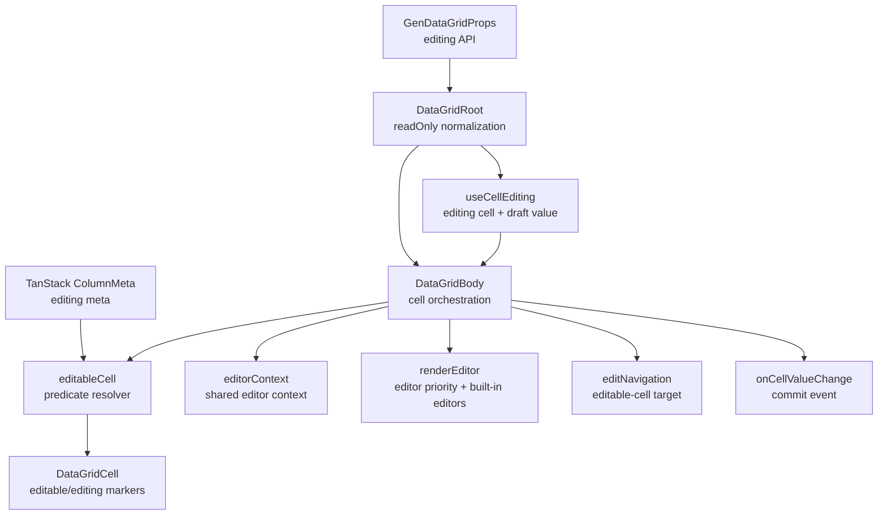
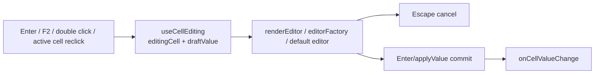

<!-- packages/gen-datagrid/docs/architecture/gate-4-architecture.md
Documents the Gate 4 editing architecture for GenDataGrid.
-->

# GenDataGrid Gate 4 Architecture

용어 기준: Active Cell, Editable Cell, Editing Cell, Edit Mode, Draft Value, Commit, Cancel은 `../reference/terminology.md`를 따른다.

Cell Edit API 기준: editing public props, column meta, editor context, implemented/deferred 상태는 `../reference/cell-edit-api.md`를 따른다.

This document describes the current Gate 4 editing API, editable cell predicate, and runtime editor rendering slice.

## Component Relationship

## Editable Predicate Flow

## Edit Runtime Flow

## Current Rules

- `readOnly` and `readonly` disable editing for all cells.
- `isCellEditable(ctx)` is evaluated before column meta.
- `column.meta.editable === false` disables the cell.
- `column.meta.editable === true` enables the cell.
- `column.meta.editable(ctx)` can decide per row/cell.
- A column is treated as editable when it has editor capability such as `renderEditor`, `editType`, `editOptions`, or `getEditOptions`.
- Editable cells render `data-editable-cell="true"`.
- Editing cells render `data-editing-cell="true"`.
- Editor rendering priority is column `renderEditor`, then grid `editorFactory`, then built-in default editor.
- `renderEditor` and `editorFactory` receive the same `GenDataGridEditorContext`.
- `DataGridBody` keeps row/cell orchestration while `features/editing/editorContext.ts`, `renderEditor.tsx`, and `editNavigation.ts` own editor context construction, editor rendering, and editable-cell target calculation.
- Built-in editors support text, number, date, select, textarea, and checkbox surfaces.
- `editSelectOnFocus` can select built-in input editor text on focus; column meta overrides the grid-level prop.
- `editCommitOnBlur` can commit built-in editor values on blur or before activating another cell; column meta overrides the grid-level prop.
- Enter and F2 start editing the active editable cell.
- Clicking an already active editable cell starts editing.
- Double-click starts editing the clicked editable cell.
- Escape cancels editing without emitting `onCellValueChange`.
- Enter commits the draft value through `onCellValueChange`; GenDataGrid does not mutate row data in this slice.
- Blur commits the draft value when `editCommitOnBlur` is enabled.
- Tab and Shift+Tab move active cell inside the grid; while editing, they commit the current value and move to the next or previous editable cell.

## Public And Implemented API Surface

- `readOnly`
- `readonly`
- `editSelectOnFocus`
- `editCommitOnBlur`
- `editorFactory`
- `isCellEditable`
- `onCellValueChange`
- column meta `editable`
- column meta `editType`
- column meta `editOptions`
- column meta `getEditOptions`
- column meta `editPlaceholder`
- column meta `editSelectOnFocus`
- column meta `editCommitOnBlur`
- column meta `renderEditor`
- `useCellEditing`
- default editor rendering
- custom editor rendering
- Enter/F2/double-click edit entry
- Escape cancel
- Enter commit
- blur commit for built-in editors when `editCommitOnBlur` is enabled
- Tab/Shift+Tab active-cell navigation
- Tab/Shift+Tab edit commit and editable-cell navigation

Deferred public props:

- `editOnActiveCell`
- `keepEditingOnNavigate`

These props are reserved for the navigation-editing policy slice. They remain in the public type surface and emit runtime warnings when enabled, but they do not change runtime behavior in Gate 4.

## Deferred Features

- advanced blur/portal commit policy
- printable-key edit entry
