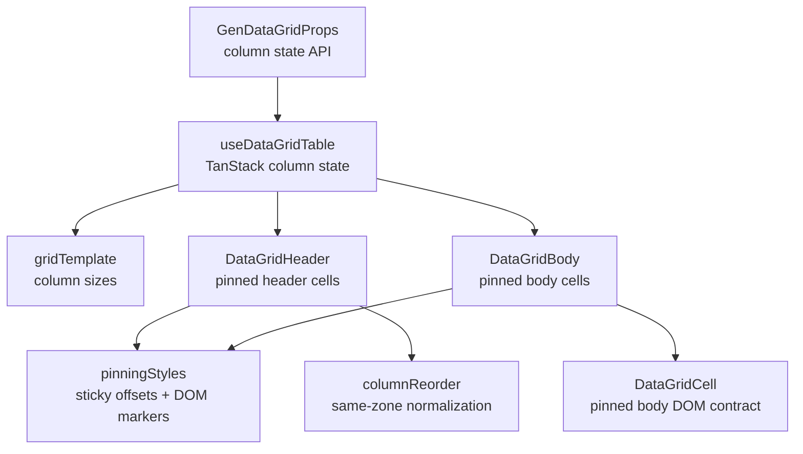

<!-- packages/gen-datagrid/docs/architecture/gate-5-architecture.md
Documents the Gate 5 column pinning, sizing, and reorder architecture for GenDataGrid.
-->

# GenDataGrid Gate 5 Architecture

Gate 5 stabilizes column pinning, sizing, and reorder on top of the existing div grid layout. This document tracks the current Gate 5 slice.

## Component Relationship

## Implemented Slice

- `columnPinning`, `defaultColumnPinning`, and `onColumnPinningChange` are public state props.
- `enablePinning`, `enableColumnSizing`, and `enableColumnReorder` are public feature flags.
- `useDataGridTable` wires `columnPinning` into TanStack Table state.
- `features/pinning/pinningStyles.ts` centralizes sticky offset style and pinned-edge marker calculation.
- `features/reorder/columnReorder.ts` centralizes same-zone reorder normalization.
- Header and body cells render:
  - `data-pinned-cell="left"` or `data-pinned-cell="right"`
  - `data-pinned-edge="left-end"` for the last left pinned column
  - `data-pinned-edge="right-start"` for the first right pinned column
- Pinned cells use `position: sticky` with TanStack `column.getStart('left')` and `column.getAfter('right')` offsets.
- Header cells render resize handles through TanStack `header.getResizeHandler()`.
- Header drag/drop reorder calls `table.setColumnOrder()` only when the moving and target columns are in the same pinning zone.
- Baseline SSR coverage verifies pinned markers, sticky offset output, and resize/reorder affordances.
- Vitest coverage verifies same-zone reorder and cross-zone blocking.

## Deferred Gate 5 Work

- Pinning controls or menu UI.
- Grouped header span behavior with pinning.
- Browser-level visual verification for resize behavior, drag indicator polish, and pinned shadow/z-index behavior.
