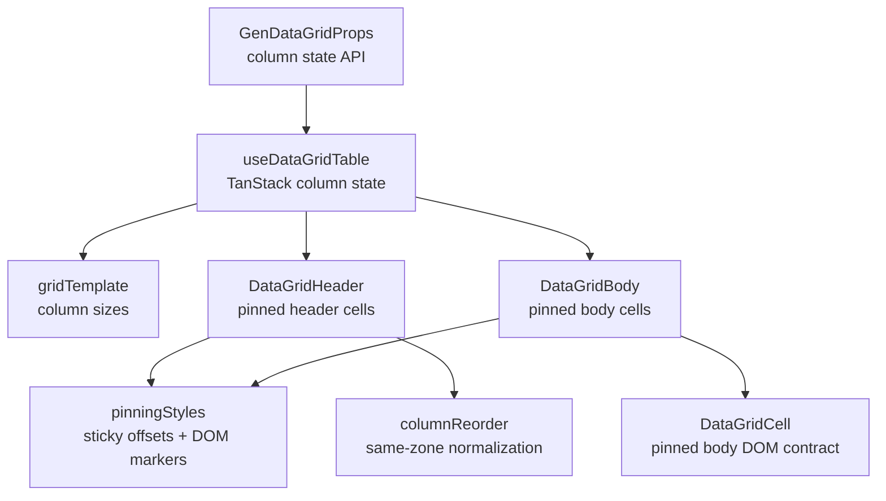

<!-- packages/gen-datagrid/docs/architecture/gate-5-architecture.md
Documents the Gate 5 column pinning, sizing, and reorder architecture for GenDataGrid.
-->

# GenDataGrid Gate 5 Architecture

Gate 5 stabilizes column pinning, sizing, and reorder on top of the existing div grid layout. This document tracks the current Gate 5 slice.

## Component Relationship

## Implemented Slice

- `columnPinning`, `defaultColumnPinning`, and `onColumnPinningChange` are public state props.
- `enablePinning`, `enableColumnSizing`, and `enableColumnReorder` are public feature flags.
- `useDataGridTable` wires `columnPinning` into TanStack Table state.
- `features/pinning/pinningStyles.ts` centralizes sticky offset style and pinned-edge marker calculation.
- `features/reorder/columnReorder.ts` centralizes same-zone reorder normalization.
- Pinned zone order is driven by `columnPinning.left` and `columnPinning.right`, so pinned reorder updates both `columnOrder` and the matching pinning array.
- Header, body, navigation column ids, and `grid-template-columns` all use the same left/center/right ordered visible column model.
- Header and body cells render:
  - `data-pinned-cell="left"` or `data-pinned-cell="right"`
  - `data-pinned-edge="left-end"` for the last left pinned column
  - `data-pinned-edge="right-start"` for the first right pinned column
- Pinned cells use `position: sticky` with TanStack `column.getStart('left')` and `column.getAfter('right')` offsets.
- Header cells render resize handles through TanStack `header.getResizeHandler()`.
- Header cells render an explicit reorder handle button with `data-column-reorder-handle="true"`, and this button is the only draggable reorder source.
- Header drag/drop reorder calls `table.setColumnOrder()` only when the moving and target columns are in the same pinning zone.
- Header label text and resize handles are separate from the draggable reorder source so native drag from the column boundary or label area cannot promote into column reorder.
- Pinned header, body, and editing cells use separate z-index layers so sticky headers, active cells, and inline editors do not fight for the same stacking order.
- Selected pinned body cells keep their selection background instead of being reset to the pinned white background.
- Root-scoped focus uses the grid viewport marker and pinned header bounds to keep active unpinned cells fully visible outside left/right pinned overlays during keyboard navigation and mouse activation.
- `Gate5PinningSizingReorder` provides the Storybook visual-check scenario for pinning, sizing, reorder, range selection, and editing combinations.
- Baseline SSR coverage verifies pinned markers, sticky offset output, and resize/reorder affordances.
- Vitest coverage verifies same-zone reorder and cross-zone blocking.
- Manual browser verification guidance is documented in `../qa/gate-5-visual-test-guide.md`.

## Deferred Gate 5 Work

- Pinning controls or menu UI.
- Grouped header span behavior with pinning.
- Automated browser screenshot coverage for resize behavior, drag indicator polish, and pinned shadow/z-index behavior.
