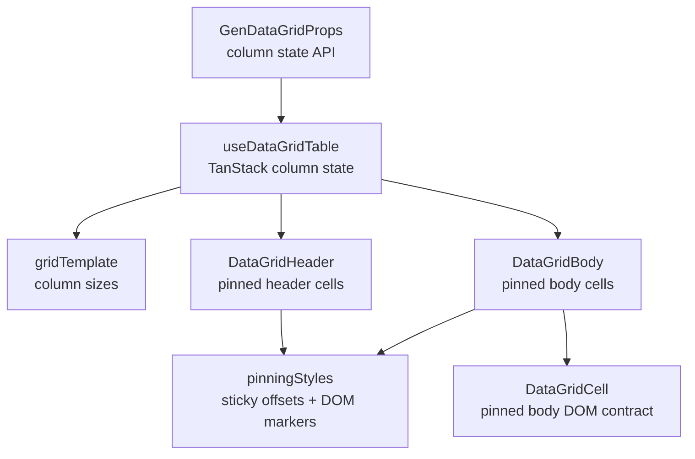

<!-- packages/gen-datagrid/docs/architecture/gate-5-architecture.md
Documents the Gate 5 column pinning, sizing, and reorder architecture for GenDataGrid.
-->

# GenDataGrid Gate 5 Architecture

Gate 5 stabilizes column pinning, sizing, and reorder on top of the existing div grid layout. This document tracks the initial Gate 5 slice.

## Component Relationship

## Implemented Initial Slice

- `columnPinning`, `defaultColumnPinning`, and `onColumnPinningChange` are public state props.
- `useDataGridTable` wires `columnPinning` into TanStack Table state.
- `features/pinning/pinningStyles.ts` centralizes sticky offset style and pinned-edge marker calculation.
- Header and body cells render:
  - `data-pinned-cell="left"` or `data-pinned-cell="right"`
  - `data-pinned-edge="left-end"` for the last left pinned column
  - `data-pinned-edge="right-start"` for the first right pinned column
- Pinned cells use `position: sticky` with TanStack `column.getStart('left')` and `column.getAfter('right')` offsets.
- Baseline SSR coverage verifies pinned markers and sticky offset output.

## Deferred Gate 5 Work

- Resize handle pointer interaction.
- Drag/drop column reorder interaction.
- Reorder normalization across pinning zones.
- Pinning controls or menu UI.
- Grouped header span behavior with pinning.
- Browser-level visual verification for pinned shadow/z-index behavior.
