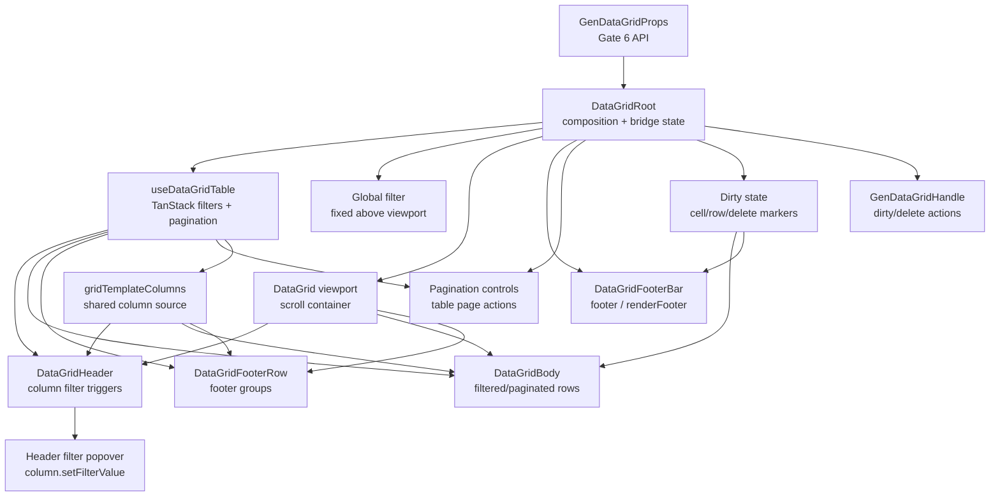
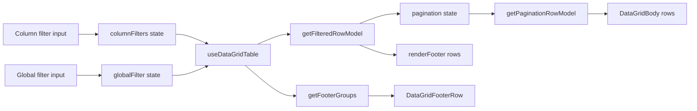
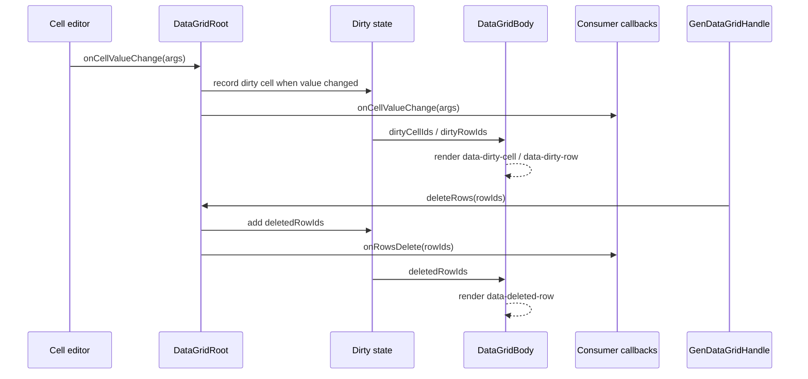

<!-- packages/gen-datagrid/docs/architecture/gate-6-architecture.md
Documents the Gate 6 filtering, footer, pagination, and dirty state architecture.
-->

# GenDataGrid Gate 6 Architecture

Gate 6 adds filtering, footer rows, grid-level footer bar rendering, pagination, and dirty state on top of the Gate 5 div grid layout. This document tracks the current Gate 6 slice.

## Implemented Slice

- `columnFilters`, `defaultColumnFilters`, `onColumnFiltersChange`, `globalFilter`, `defaultGlobalFilter`, and `onGlobalFilterChange` are public filtering state props.
- `pagination`, `defaultPagination`, and `onPaginationChange` are public pagination state props.
- `enableColumnFilters`, `enableGlobalFilter`, `enableFooterRow`, `enableStickyFooterRow`, `enableFooter`, `enablePagination`, and `enableDirtyState` are public feature flags.
- `useDataGridTable` wires TanStack column filters, global filter, filtered row model, pagination state, and pagination row model.
- `DataGridHeader` renders a column filter trigger and minimal input popover for filterable columns.
- `DataGridRoot` renders the global filter input above the table viewport.
- `.gen-datagrid__viewport` is the only table scroll container. Header, body, and footer row scroll together, while pagination and `DataGridFooterBar` stay outside the table viewport.
- `DataGridFooterRow` renders TanStack footer groups through column `footer` definitions and shares the same ordered visible columns and `grid-template-columns` source as header/body.
- `DataGridFooterBar` renders the grid-level `footer` or `renderFooter` slot below pagination.
- Dirty state is tracked in `DataGridRoot` from committed `onCellValueChange` events and delete requests.
- Body rows and cells render dirty/deleted DOM markers:
  - `data-dirty-cell="true"`
  - `data-dirty-row="true"`
  - `data-deleted-row="true"`
- `GenDataGridHandle` exposes `resetDirtyState(rowIds?)`, `commitDirtyState(rowIds?)`, `deleteRows(rowIds)`, and `getDirtyState()`.
- `Gate6FilteringFooterPaginationDirtyState` provides the Storybook visual-check scenario for filters, footer row, sticky footer row, pagination, dirty markers, deleted row markers, and footer bar behavior.
- Baseline SSR coverage verifies footer row, filter trigger, pagination, footer bar, and viewport markers.
- Vitest coverage verifies column/global filtering, pagination, dirty state, and delete-row marker behavior.

## Component Relationship

`DataGridRoot` owns Gate 6 composition and state bridging.

- `useDataGridTable` wires TanStack column filters, global filter, and pagination state.
- `DataGridHeader` renders per-column filter triggers and the inline filter popover.
- `DataGridBody` renders the current row model and receives dirty cell/row marker sets.
- `DataGridFooterRow` renders TanStack footer groups with the same visible column model and grid template as header/body.
- `DataGridRoot` owns global filter input, the table viewport, pagination controls, and `DataGridFooterBar`.
- Header/body/footer row share the viewport scroll area. Pagination and `DataGridFooterBar` are outside that scroll area.

## Data Flow

Filtering and pagination stay in the TanStack adapter. Controlled props win over uncontrolled defaults:

- `columnFilters`, `defaultColumnFilters`, `onColumnFiltersChange`
- `globalFilter`, `defaultGlobalFilter`, `onGlobalFilterChange`
- `pagination`, `defaultPagination`, `onPaginationChange`

The renderer consumes `table.getRowModel().rows`, so enabling pagination switches the body to the paginated row model. Footer rows use `table.getFooterGroups()` and the same ordered visible columns used by header/body.

## Dirty State

Dirty state is grid-local application state, not TanStack state. `DataGridRoot` wraps `onCellValueChange` and records changed cells when `previousValue` and `value` are not `Object.is` equal.

Dirty state currently marks committed cell edits only. The grid does not mutate `data`; consumers still own data updates.

Imperative handle additions:

- `resetDirtyState(rowIds?)`
- `commitDirtyState(rowIds?)`
- `deleteRows(rowIds)`
- `getDirtyState()`

`commitDirtyState` currently clears tracked dirty markers like `resetDirtyState`. A later data mutation slice can distinguish baseline acceptance from visual reset if the package takes ownership of data state.

## DOM Contract

Gate 6 adds these DOM markers:

- `data-column-filter-trigger="true"`
- `data-column-filter-popover="true"`
- `data-global-filter="true"`
- `data-gen-datagrid-viewport="true"`
- `data-gen-datagrid-footer-row="true"`
- `data-cell-kind="footer"`
- `data-gen-datagrid-pagination="true"`
- `data-gen-datagrid-footer-bar="true"`
- `data-dirty-cell="true"`
- `data-dirty-row="true"`
- `data-deleted-row="true"`

The no-table-tags contract remains unchanged.

## Deferred

- Manual/server filtering and pagination totals.
- Page size selector.
- Delete-row data mutation; `deleteRows(rowIds)` currently emits a delete request and marks rows as deleted.
- Dirty baseline integration with `dataVersion`.
- Advanced filter operators and typed filter editors.
