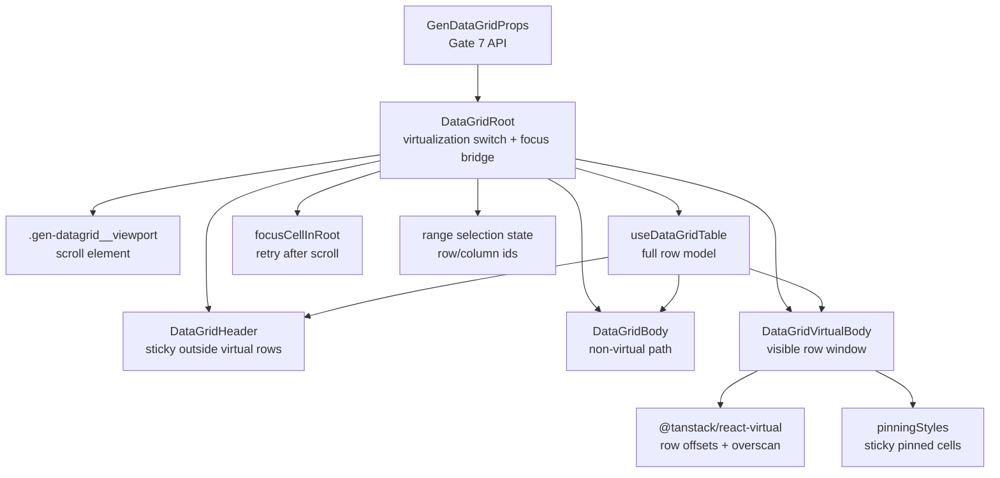

<!-- packages/gen-datagrid/docs/architecture/gate-7-architecture.md
Documents the Gate 7 row virtualization architecture for GenDataGrid.
-->

# GenDataGrid Gate 7 Architecture

Gate 7 adds fixed-height row virtualization on top of the Gate 6 filtering, footer, pagination, and dirty-state slice. This document tracks the current Gate 7 slice.

## Implemented Slice

- `enableVirtualization` is a public feature flag for row virtualization.
- Gate 7 keeps virtualization scoped to body rows. Header, footer row, pagination, and footer bar stay outside the virtualizer.
- `renderers/div-grid/DataGridVirtualBody.tsx` owns the virtual row window and renders only the visible row range plus overscan.
- `@tanstack/react-virtual` owns viewport-based row measurement with a fixed `rowHeight`.
- `getRowHeight` remains supported only when `enableVirtualization !== true`.
- `DataGridRoot` owns the virtualization switch and passes the shared ordered visible column model to either `DataGridBody` or `DataGridVirtualBody`.
- Active-cell focus restore is row/column coordinate based. When the target row is outside the current virtual range, the viewport scrolls to the row index before focus is retried.
- Keyboard navigation keeps using the full row id order, then bridges that result into virtual scroll restoration.
- Pinned columns keep using the existing sticky offset model from `features/pinning/pinningStyles.ts`.
- Range selection keeps using row/column ids as its state contract so selection styling is restored when a row re-enters the virtual range.
- Virtual body rows expose `data-row-index` and keep the existing body cell DOM contract:
  - `data-gen-datagrid-cell="true"`
  - `data-cell-kind="body"`
  - `data-rowid`
  - `data-colid`
- `aria-rowcount` remains bound to the full row model length, not the rendered virtual count.
- Manual browser verification guidance is documented in `../qa/gate-7-visual-test-guide.md`.

## Component Relationship

## Rendering Contract

- The viewport remains the only vertical scroll container.
- Virtualization applies only to the body rowgroup.
- The virtual body renders:
  - a body container sized to `virtualizer.getTotalSize()`
  - absolutely positioned row containers using fixed `top` offsets
- Each rendered row still uses the shared `gridTemplateColumns` string.
- Pinned cells stay `position: sticky`; virtualization must not wrap cells in a transformed ancestor that breaks sticky positioning.

## Focus And Scroll Contract

- `activeCell` is still stored as `{ rowId, columnId }`.
- When `activeCell` changes under virtualization:
  - resolve the target row index from `rowIds`
  - scroll the virtualizer to that index
  - retry `focusCellInRoot(...)` on the next animation frame
- `PageUp`, `PageDown`, `Home`, `End`, arrow navigation, and tab navigation all use the full row list, not the currently rendered virtual subset.

## Deferred Gate 7 Work

- Dynamic row measurement while virtualization is enabled.
- Column virtualization.
- Auto-scroll while drag range selection crosses beyond the current viewport.
- Browser screenshot automation for large-row scenarios.
