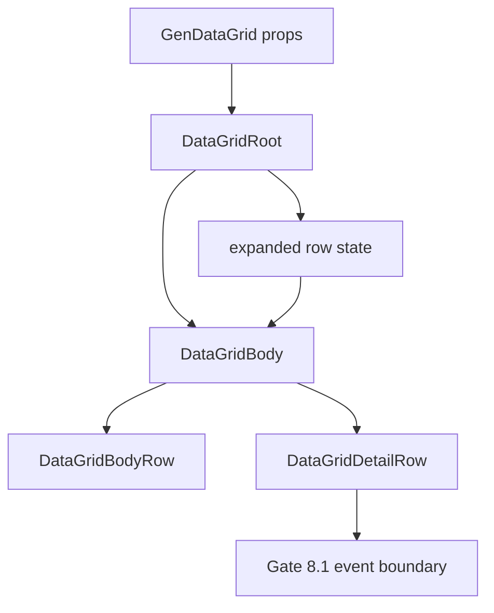

<!-- packages/gen-datagrid/docs/architecture/gate-8-2-master-detail-architecture.md
Documents Gate 8.2 master-detail row architecture for GenDataGrid.
-->

# GenDataGrid Gate 8.2 Master-detail Row Architecture

Gate 8.2는 Gate 8.1에서 정리한 multi-grid boundary와 ownership 규칙 위에, 데이터 row 아래에 fixed-height detail panel을 붙이는 master-detail row slice다.

이번 slice는 nested `GenDataGrid`를 공식 조합으로 보장하는 단계가 아니다. 8.2의 목적은 expand/collapse 상태 계약, detail row 렌더링 위치, detail panel 이벤트 경계, non-virtualized body 동작을 먼저 고정하는 것이다. nested grid 공식 조합은 Gate 8.3, dynamic row height와 virtualization 통합은 Gate 8.4 이후로 분리한다.

## 구현 범위

- row id 기반 expand/collapse state contract
- controlled/uncontrolled `expandedRows` 지원
- fixed-height detail panel 렌더링
- non-virtualized body path 전용 master-detail baseline
- detail row DOM marker와 parent row 관계 marker
- detail panel 내부 mouse/key 이벤트가 parent range selection과 keyboard navigation을 깨지 않도록 guard
- Storybook 수동 테스트 시나리오
- interaction test coverage

Gate 8.2에서 제외한 항목:

- nested `GenDataGrid` 공식 composition 보장
- dynamic detail height measurement
- virtualization과 detail panel 통합
- tree row model
- row merge/span
- detail panel 전용 layout framework
- detail panel context menu feature

## Public API

```ts
type GenDataGridExpandedRowState = Record<string, boolean>;

type GenDataGridRowContext<TData> = {
  row: TData;
  rowId: string;
  rowIndex: number;
};

type GenDataGridDetailPanelContext<TData> = GenDataGridRowContext<TData> & {
  expanded: boolean;
  collapse: () => void;
};

type GenDataGridProps<TData> = {
  enableMasterDetail?: boolean;
  expandedRows?: GenDataGridExpandedRowState;
  defaultExpandedRows?: GenDataGridExpandedRowState;
  onExpandedRowsChange?: (next: GenDataGridExpandedRowState) => void;
  getRowCanExpand?: (ctx: GenDataGridRowContext<TData>) => boolean;
  renderDetailPanel?: (ctx: GenDataGridDetailPanelContext<TData>) => React.ReactNode;
  detailPanelHeight?: number;
};
```

정책:

- `enableMasterDetail` 기본값은 `false`다.
- `detailPanelHeight`는 fixed-height만 지원하고 기본값은 `160`이다.
- row는 `enableMasterDetail`, `renderDetailPanel`, `getRowCanExpand` 조건을 모두 통과할 때만 확장 가능하다.
- controlled `expandedRows`가 있으면 내부 state를 변경하지 않고 `onExpandedRowsChange`만 호출한다.
- uncontrolled 모드에서는 `defaultExpandedRows`로 초기화한다.
- `onExpandedRowsChange`는 `true` 항목만 남긴 normalized object를 받는다.
- expanded state는 row index가 아니라 row id 기준이다.
- filtering/sorting/pagination으로 row가 렌더링 모델에서 빠지면 state는 남아도 panel은 보이지 않는다.
- `enableVirtualization && enableMasterDetail` 조합은 Gate 8.2에서 비활성이다.

## Rendering Contract

Detail panel은 owner body row 바로 다음에 추가 row로 렌더링된다.

```html
<div role=row data-rowid=1 data-expanded-row=true>...</div>
<div
  role=row
  data-gen-datagrid-detail-row=true
  data-parent-rowid=1
>
  <div data-gen-datagrid-detail-panel=true>...</div>
</div>
```

Detail row 정책:

- detail row는 같은 scroll viewport 안에 위치한다.
- detail row는 data row가 아니며 active cell navigation 대상이 아니다.
- detail row는 `data-gen-datagrid-cell=true` 같은 body cell marker를 노출하지 않는다.
- detail panel은 전체 grid width를 span한다.
- detail panel 내부에는 button, input, custom panel 같은 interactive content를 둘 수 있다.
- detail panel 내부 interaction은 parent range selection 시작점으로 해석되지 않는다.

## Interaction Contract

| 항목 | Gate 8.2 정책 |
| --- | --- |
| Active cell | 기존 data cell navigation 유지, detail row는 skip |
| Keyboard navigation | data cell 사이 이동만 유지, detail 내부 interactive element는 자기 이벤트를 소유 |
| Range selection | detail panel 내부에서 parent range selection 시작 불가 |
| Editing | data cell editing contract 유지, detail content는 consumer가 렌더링한 별도 UI |
| Clipboard | focused grid ownership은 Gate 8.1 규칙 유지, detail interactive content paste는 grid가 가로채지 않음 |
| Filtering/sorting | parent row가 visible row model에 있을 때만 detail panel 렌더링 |
| Pagination | 현재 page row에 대해서만 panel 렌더링 |
| Virtualization | Gate 8.2에서는 master-detail 렌더링 비활성 |

## Component Relationship



## 구현 파일

- `src/GenDataGrid.types.ts`
  - `GenDataGridExpandedRowState`, row/detail context, public props 추가
- `src/features/master-detail/masterDetailState.ts`
  - expanded row state normalize/update helper
- `src/renderers/div-grid/DataGridRoot.tsx`
  - controlled/uncontrolled expanded state 해석과 non-virtual body 전달
- `src/renderers/div-grid/DataGridBody.tsx`
  - expanded owner row 직후 `DataGridDetailRow` 렌더링
- `src/renderers/div-grid/DataGridBodyRow.tsx`
  - 첫 번째 visible body cell에 명시적 expand/collapse button 렌더링
- `src/renderers/div-grid/DataGridDetailRow.tsx`
  - detail row DOM marker, fixed height, event guard
- `src/index.css`
  - detail toggle, detail row, detail panel 스타일
- `test/interaction.test.tsx`
  - default expanded, uncontrolled toggle, controlled callback, virtualization disabled, detail event boundary 테스트
- `src/stories/GenDataGrid.baseline.stories.tsx`
  - `Gate82MasterDetailRow` 수동 테스트 story

## 완료 기준

- non-virtualized body path에서 master-detail row가 동작한다.
- controlled/uncontrolled expanded state를 모두 지원한다.
- detail panel은 fixed-height, row-id 기반으로 렌더링된다.
- detail row는 navigation, selection, editing, clipboard에서 data row로 취급되지 않는다.
- Gate 8.1 ownership 규칙을 깨지 않는다.
- virtualization과 dynamic height 조합은 명시적으로 deferred 상태다.

## 검증

- `pnpm -C frontend/packages/gen-datagrid exec tsc -p tsconfig.json --noEmit`
- `pnpm -C frontend/packages/gen-datagrid test:interaction`