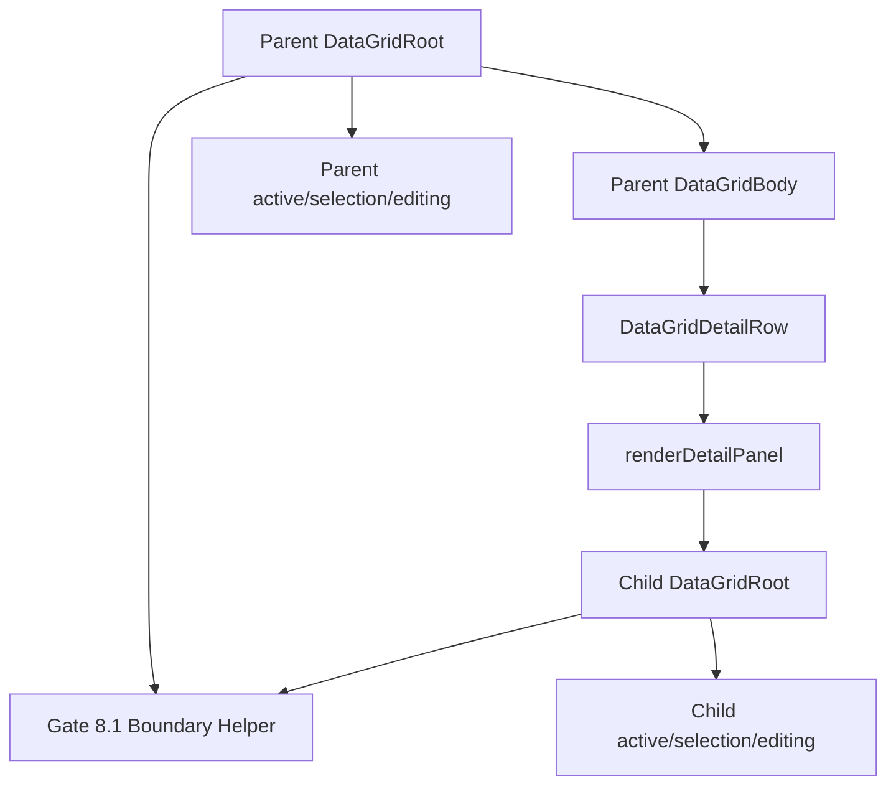

<!-- packages/gen-datagrid/docs/architecture/gate-8-3-nested-grid-composition-architecture.md
Documents the Gate 8.3 nested GenDataGrid composition architecture for GenDataGrid.
-->

# GenDataGrid Gate 8.3 Nested Grid Composition Architecture

Gate 8.3은 Gate 8.2의 `renderDetailPanel` 안에 child `GenDataGrid`를 넣는 조합을 공식 시나리오로 검증하는 slice다. Gate 8.1에서 root boundary와 ownership 규칙을 정리했고, Gate 8.2에서 fixed-height detail panel을 구현했으므로, Gate 8.3은 두 기반을 실제 master-detail + nested grid 조합에서 안정적으로 동작하도록 고정한다.

이번 gate의 핵심은 새 row model을 만드는 것이 아니라 parent grid와 child grid의 상태, 이벤트, clipboard, editing lifecycle이 서로 섞이지 않는다는 것을 보장하는 것이다.

## 구현 전 요약

| 항목 | 결정 |
| --- | --- |
| 구현 대상 | detail panel 내부 nested `GenDataGrid` 공식 composition |
| 기반 기능 | Gate 8.1 boundary helper, Gate 8.2 master-detail row |
| public API | 새 API 추가 없이 기존 `renderDetailPanel` 조합을 우선 사용 |
| row height | Gate 8.2와 동일하게 fixed `detailPanelHeight` 유지 |
| virtualization | parent master-detail + virtualization 조합은 계속 deferred |
| dynamic height | child grid 높이 자동 측정은 Gate 8.4 이후로 deferred |
| 테스트 중심 | parent/child active cell, selection, editing, clipboard ownership |


## Implemented Slice

- `Gate83NestedGridComposition` Storybook scenario를 추가해 detail panel 안에 child `GenDataGrid`를 렌더링하는 공식 조합을 수동 검증할 수 있게 했다.
- parent grid는 `enableMasterDetail`, controlled `expandedRows`, fixed `detailPanelHeight`를 사용한다.
- child grid는 parent row 1 detail panel 안에서 독립적인 `gridId`, data, active cell, selected range, editing callback을 가진다.
- parent/child active cell, range selection, edit callback을 Storybook events 영역에서 구분해 표시한다.
- interaction tests에서 child keyboard, range selection, paste, copy ownership과 parent ownership return을 detail panel 조합 기준으로 검증한다.
- 새 public API는 추가하지 않았다.
## Scope

Gate 8.3에서 구현/검증할 항목:

- `renderDetailPanel` 안에 child `GenDataGrid`를 렌더링하는 공식 Storybook scenario
- parent grid와 child grid의 active cell 독립성
- parent grid와 child grid의 selected range 독립성
- child grid keyboard navigation이 parent grid를 움직이지 않는지 확인
- child grid range selection이 parent selected ranges를 변경하지 않는지 확인
- child grid copy/paste가 parent clipboard/paste 경로를 건드리지 않는지 확인
- child grid editing commit/cancel이 parent editing lifecycle을 깨지 않는지 확인
- parent data cell을 다시 클릭하면 keyboard ownership이 parent로 복귀하는지 확인
- interaction regression tests 추가
- QA 문서와 manual test story 추가

Gate 8.3에서 제외할 항목:

- dynamic detail panel height measurement
- parent row가 child grid height에 맞춰 자동으로 커지는 동작
- parent virtualization과 expanded detail row 통합
- child grid data loading API
- parent row와 child row의 관계형 data model
- tree row model
- row merge/span
- cross-grid selection 또는 cross-grid clipboard

## Public API Policy

Gate 8.3은 새 public API를 추가하지 않는 것을 기본 권장안으로 둔다.

기존 조합:

```tsx
<GenDataGrid
  enableMasterDetail
  renderDetailPanel={({ row }) => (
    <GenDataGrid
      gridId={`child-${row.id}`}
      data={row.children}
      columns={childColumns}
      getRowId={(child) => child.id}
    />
  )}
/>
```

필수 사용 지침:

- parent와 child는 서로 다른 `gridId`를 가져야 한다.
- child grid의 `data`, `columns`, `activeCell`, `selectedRanges`, editing state는 parent와 별도로 관리한다.
- child grid 높이는 detail panel 안에서 명시적으로 제한해야 한다.
- parent `detailPanelHeight`는 child grid가 사용할 수 있는 충분한 높이로 지정한다.

새 API가 필요한지 여부는 구현 중 문제가 확인될 때만 재검토한다. 예를 들어 child grid 높이 자동 측정, lazy loading, parent-child row relation helper는 Gate 8.3 범위가 아니다.

## Ownership Contract

| 영역 | 보장해야 할 동작 |
| --- | --- |
| Focus | child cell에 focus가 있으면 parent focus restore가 이를 빼앗지 않는다. |
| Keyboard | child Arrow/Enter/F2/Tab/Escape는 child grid에서만 처리된다. |
| Active cell | parent active cell과 child active cell은 서로 독립적으로 유지된다. |
| Range selection | child drag selection은 parent selected ranges를 만들거나 변경하지 않는다. |
| Clipboard copy | child grid에 focus가 있으면 child selection만 copy된다. |
| Clipboard paste | child grid에 focus가 있으면 child editable cell에만 paste가 적용된다. |
| Editing | child editor commit/cancel은 parent editor lifecycle을 건드리지 않는다. |
| Parent return | parent data cell을 클릭하면 parent가 다시 keyboard owner가 된다. |

## Rendering Contract

Parent detail panel 안에 child grid root가 들어간다.

```html
<div data-gen-datagrid-root=true data-grid-id=parent>
  <div data-rowid=1>...</div>
  <div data-gen-datagrid-detail-row=true data-parent-rowid=1>
    <div data-gen-datagrid-detail-panel=true>
      <div data-gen-datagrid-root=true data-grid-id=child-1>
        ...child grid...
      </div>
    </div>
  </div>
</div>
```

DOM 정책:

- child grid root는 반드시 parent root 안에 중첩될 수 있다.
- ownership 판단은 `gridId` 문자열 비교가 아니라 nearest `data-gen-datagrid-root=true` 기준이어야 한다.
- parent DOM lookup은 child body cell을 parent cell로 해석하면 안 된다.
- detail row 자체는 parent data row가 아니므로 active cell navigation 대상이 아니다.

## Component Relationship



## Implementation Plan

1. Add `Gate83NestedGridComposition` Storybook scenario.
2. Render parent grid with `enableMasterDetail`, controlled `expandedRows`, and fixed `detailPanelHeight`.
3. Render child `GenDataGrid` inside `renderDetailPanel` for at least one expanded row.
4. Add visible event log for parent/child active cell, range selection, paste/edit callbacks.
5. Add interaction tests for child keyboard ownership inside a detail panel.
6. Add interaction tests for child range selection not changing parent selection.
7. Add interaction tests for child copy/paste ownership inside a detail panel.
8. Add interaction tests for parent ownership return after parent data cell click.
9. Add QA guide for manual checks.
10. Update README, plan, and implementation log after implementation.

## Test Plan

Automated tests:

- child grid Arrow key changes child active cell only
- parent active cell remains stable while child grid is focused
- child grid range drag calls child `onSelectedRangesChange` only
- child grid copy uses child selected range only
- child grid paste calls child `onCellValueChange` only
- child grid edit commit calls child change handler only
- parent data cell click returns keyboard ownership to parent
- parent Arrow key after return changes parent active cell only

Manual Storybook checks:

- expand parent row and verify child grid appears in detail panel
- click child cell and move with Arrow keys
- drag child range selection and confirm parent range does not change
- copy from child selection and confirm copied text is child data
- paste into child editable cell and confirm parent data is unchanged
- edit child cell and confirm parent edit state is unaffected
- click parent data cell and confirm parent keyboard navigation resumes

## Completion Criteria

- Nested `GenDataGrid` inside detail panel is an officially documented and tested composition.
- Parent and child active cell states remain independent.
- Parent and child range selection states remain independent.
- Clipboard and paste ownership follow the focused child or parent grid correctly.
- Editing lifecycle remains scoped to the owning grid.
- The implementation does not require dynamic row height or virtualization support.
- Existing Gate 8.1 and Gate 8.2 behavior remains intact.

## Deferred

| Deferred item | Later gate |
| --- | --- |
| detail panel auto height measurement | Gate 8.4 |
| parent virtualization + expanded detail row | Gate 8.4 이후 |
| tree row model | Gate 8.5 |
| row merge/span | Gate 8.6 |
| cross-grid selection or clipboard | 별도 확장 논의 필요 |