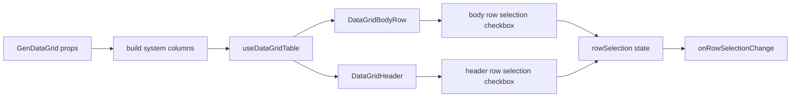

<!-- packages/gen-datagrid/docs/architecture/gate-8-7-system-columns-architecture.md
Documents the implemented GenDataGrid system column architecture for row number, row selection, and row status.
-->

# GenDataGrid Gate 8.7 System Columns Architecture

Gate 8.7 closes the MVP acceptance gap for row number, row selection, and row status. These features should be implemented as system columns that participate in the existing TanStack table model instead of being rendered as separate DOM lanes.

## Status

Implemented in Gate 8.7. Runtime props for row number, row selection, and row status exist in `GenDataGrid.types.ts`, generated system columns are built in `features/system-columns/systemColumns.tsx`, and TanStack row selection state is wired through `useDataGridTable`.

Current related implementation:

- Column order, visibility, sizing, and pinning already flow through `useDataGridTable`.
- Header/body/footer already share one `gridTemplateColumns` source.
- Body rendering already consumes ordered visible TanStack cells.
- Dirty/deleted row markers already exist through dirty state.
- System columns are excluded from active-cell navigation, range selection, clipboard paste targets, resize, reorder, and column filtering.

## Scope

Included:

- `enableRowNumber`
- `enableRowSelection`
- `rowSelection`, `defaultRowSelection`, `onRowSelectionChange`
- `rowSelectionMode?: 'all' | 'createdOnly'`
- `enableRowStatus`
- `rowStatusResolver`
- generated system columns for row number, row selection, and row status
- header/body DOM markers for system cells
- interaction and Storybook coverage

Excluded:

- tree-only selection semantics
- range selection to row selection conversion
- shift-click row selection
- select all across all server-side pages
- row drag/reorder
- custom row status renderer API
- toolbar batch actions

## Public API

```ts
import type { RowSelectionState } from '@tanstack/react-table';

export type GenDataGridRowSelectionMode = 'all' | 'createdOnly';

export type GenDataGridRowStatus = 'clean' | 'created' | 'updated' | 'deleted';

export type GenDataGridRowStatusContext<TData> = {
  row: TData;
  rowId: string;
  rowIndex: number;
  dirty: boolean;
  deleted: boolean;
};

export type GenDataGridProps<TData> = {
  enableRowNumber?: boolean;
  enableRowSelection?: boolean;
  rowSelectionMode?: GenDataGridRowSelectionMode;
  rowSelection?: RowSelectionState;
  defaultRowSelection?: RowSelectionState;
  onRowSelectionChange?: (next: RowSelectionState) => void;
  enableRowStatus?: boolean;
  rowStatusResolver?: (ctx: GenDataGridRowStatusContext<TData>) => GenDataGridRowStatus;
};
```

Design notes:

- Use `enableRowSelection`, not `checkboxSelection`, for the public flag.
- Keep row selection state as TanStack `RowSelectionState`.
- Use fixed system column ids:
  - `__gen_row_status`
  - `__gen_row_selection`
  - `__gen_row_number`
- Generated system columns are prepended in this order: status, selection, number, user columns.

## Row Number

Row number displays the visible render position in the current row model.

Rules:

- Number is page-local for paginated client rows.
- Number follows filtered, sorted, paginated, expanded, and tree-visible row order.
- Original data index and global server index are deferred.
- Row number cell is not editable.
- Row number cell is excluded from body col span targets.
- Row number column defaults to a fixed width.

DOM markers:

```txt
data-system-column="true" on the header cell
data-row-number="true" on the row number content
```

## Row Selection

Row selection uses a checkbox system column backed by TanStack row selection state.

Rules:

- `rowSelection` controls state when provided.
- `defaultRowSelection` seeds uncontrolled state.
- `onRowSelectionChange` fires for both controlled and uncontrolled usage.
- Header checkbox toggles visible selectable rows only.
- `rowSelectionMode="createdOnly"` allows selecting rows whose resolved row status is `created`.
- Disabled row checkboxes remain focusable only if needed for accessibility; otherwise they are not tab stops.
- Selection state is row-id based and must survive sorting/filtering when row ids remain stable.
- `clearSelection()` should clear range selection and row selection.

DOM markers:

```txt
data-system-column="true" on the header cell
data-gen-datagrid-row-selection-checkbox="true"
data-row-selected="true"
data-row-selectable="true"
```

## Row Status

Row status displays one of `clean`, `created`, `updated`, or `deleted`.

Resolution order:

1. `rowStatusResolver(ctx)`
2. dirty/deleted state fallback
3. `clean`

Fallback rules:

- deleted row id -> `deleted`
- dirty row id -> `updated`
- otherwise -> `clean`

Rows created outside GenDataGrid should use `rowStatusResolver` to return `created`. Internal row creation is out of scope for this slice.

DOM markers:

```txt
data-system-column="true" on the header cell
data-row-status="created|updated|deleted|clean"
data-gen-datagrid-row-status="created|updated|deleted|clean"
```

## Table Model Integration

Recommended implementation:

1. Add system column props and types to `GenDataGrid.types.ts`.
2. Add `features/system-columns/systemColumns.tsx`.
3. Build generated `ColumnDef<TData, unknown>[]` before calling `useDataGridTable`.
4. Pass generated columns into the existing TanStack adapter.
5. Add TanStack row selection state to `useDataGridTable`.
6. Keep DataGrid header/body renderers generic by reading column meta markers instead of branching on ids where possible.

System column metadata should identify the kind:

```ts
meta: {
  systemColumn: 'rowStatus' | 'rowSelection' | 'rowNumber';
}
```

## Ordering, Pinning, And Sizing

Default behavior:

- System columns are prepended.
- System columns are left pinned by default when `enablePinning !== false`.
- System columns have fixed default sizes.
- System columns are not reorderable.
- System columns are not resizable in the first slice.
- System columns can be hidden only by disabling their feature flag, not by user column visibility state.

Column order policy:

- User `columnOrder` should apply to user columns.
- Generated system columns should stay before user columns regardless of `columnOrder`.
- If a consumer includes system ids in `columnOrder`, ignore those ids for MVP and preserve system order.

Pinning policy:

- Generated system columns should be part of `columnPinning.left` internally.
- Consumer `columnPinning` should not move system columns to center/right in MVP.
- Cross-zone reorder remains blocked by existing reorder normalization.

## Interaction Flow



## Implementation Notes

1. Types and table adapter
   - Added row status and row selection public types and props.
   - Added controlled/uncontrolled TanStack `RowSelectionState`.
   - Wired `state.rowSelection`, `onRowSelectionChange`, and row selectability.

2. System columns
   - Added `features/system-columns/systemColumns.tsx`.
   - Generated row status, row selection, and row number columns before user columns.
   - Marked system columns in TanStack column meta.

3. Renderer integration
   - Added DOM markers in system cell renderers.
   - Excluded system columns from active/range/clipboard data column lists.
   - Prevented system columns from resize, reorder, and filter controls.
   - Kept tree/master-detail toggles in the first user visible column.

4. Selection behavior
   - Body checkbox toggles one row id.
   - Header checkbox toggles visible selectable rows.
   - `clearSelection()` clears range selection and row selection.

5. Storybook and tests
   - Added `Gate87SystemColumns` scenario.
   - Added interaction tests for rendering, `createdOnly`, `clearSelection()`, and tree toggle placement.

## Acceptance Criteria

- Row number, row selection, and row status render only when enabled.
- Generated system columns align with header/body/footer grid templates.
- System columns do not break column sizing, pinning, reorder, filtering, pagination, virtualization, tree rows, master-detail, or body col span.
- Header select-all affects only visible selectable rows.
- Controlled row selection never mutates internal state directly.
- `clearSelection()` clears both range selection and row selection.
- Storybook and interaction tests cover the slice.

## Deferred Decisions

- Global server-side select all.
- Shift-click row selection.
- Row selection plus tree parent/child cascade policy.
- Custom row status renderer.
- User-configurable system column order.
- System column visibility through `columnVisibility`.
- Row number global offset for server pagination.
