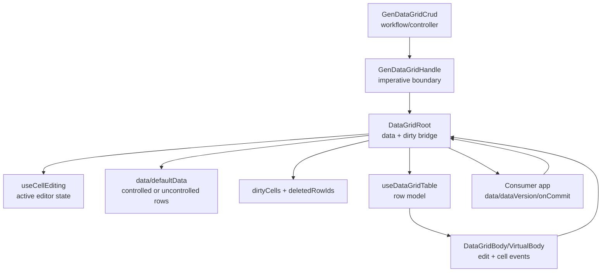
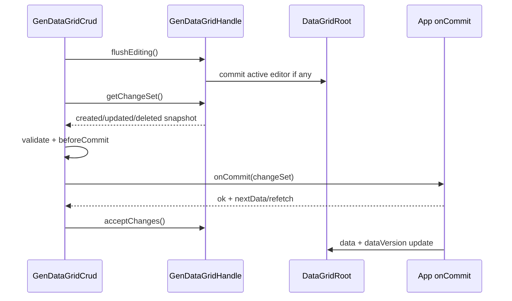

<!-- packages/gen-datagrid/docs/architecture/handle-data-ownership-architecture.md
Documents the GenDataGridHandle extension architecture for CRUD-oriented data ownership.
-->

# GenDataGridHandle Data Ownership Architecture

## Context

`GenDataGrid`는 이미 cell editing, paste, dirty marker, deleted row marker, row selection,
filtering, pagination을 갖고 있다. `GenDataGridCrud`는 이 기능을 다시 구현하지 않고
ActionBar와 commit workflow만 얇게 얹어야 한다.

이를 위해 `GenDataGridHandle`은 다음 세 가지 책임을 명확히 제공해야 한다.

- grid 내부의 최신 상태를 읽는다.
- 저장 전 편집 상태를 안전하게 종료한다.
- dirty/delete marker와 baseline transition을 명확히 제어한다.

## Current Handle

현재 handle:

```ts
type GenDataGridHandle = {
  rootElement: HTMLDivElement | null;
  clearSelection: () => void;
  copySelection: (options?: { includeHeader?: boolean }) => Promise<boolean>;
  scrollToCell: (coord: GenDataGridCellCoord) => void;
  clearColumnFilters: () => void;
  clearGlobalFilter: () => void;
  clearFilters: () => void;
  resetDirtyState: (rowIds?: readonly string[]) => void;
  commitDirtyState: (rowIds?: readonly string[]) => void;
  deleteRows: (rowIds: readonly string[]) => void;
  getDirtyState: () => GenDataGridDirtyState;
};
```

문제:

- 저장 직전 최신 data snapshot을 읽을 수 없다.
- active editor를 grid 정책에 맞게 flush할 수 없다.
- dirty marker는 읽을 수 있지만 API commit에 필요한 change set을 바로 만들기 어렵다.
- `commitDirtyState`와 baseline accept의 의미가 분리되어 있지 않다.
- created row 삽입은 public API가 없다.

## Proposed Handle Shape

```ts
type GenDataGridHandle<TData = unknown> = {
  rootElement: HTMLDivElement | null;

  clearSelection: () => void;
  copySelection: (options?: { includeHeader?: boolean }) => Promise<boolean>;
  scrollToCell: (coord: GenDataGridCellCoord) => void;

  clearColumnFilters: () => void;
  clearGlobalFilter: () => void;
  clearFilters: () => void;

  flushEditing: () => Promise<void>;
  cancelEditing: () => void;

  getData: () => TData[];
  getRow: (rowId: string) => TData | undefined;
  getDirtyState: () => GenDataGridDirtyState;
  getChangeSet: () => GenDataGridChangeSet<TData>;

  resetDirtyState: (rowIds?: readonly string[]) => void;
  commitDirtyState: (rowIds?: readonly string[]) => void;
  acceptChanges: (rowIds?: readonly string[]) => void;
  revertChanges: (rowIds?: readonly string[]) => void;

  deleteRows: (rowIds: readonly string[]) => void;
  insertRows?: (
    rows: readonly TData[],
    options?: { position?: 'start' | 'end' | { afterRowId: string } }
  ) => string[];
  load?: (nextData: readonly TData[], options?: { accept?: boolean }) => void;
};
```

`insertRows`와 `load`는 data ownership 결정이 필요하므로 optional 또는 later slice로 둔다.

## Component Relationship



## Save Sequence For GenDataGridCrud



## Data Ownership Policy

### Controlled data

Controlled `data` remains consumer-owned.

- `getData()` returns the current rendered data snapshot.
- `acceptChanges()` clears dirty/delete markers but does not mutate consumer data.
- `revertChanges()` should not mutate data; initial implementation can no-op and warn or only clear markers.
- `insertRows()` should not be implemented until a controlled data mutation callback exists.
- `dataVersion` remains the primary external baseline reset signal.

### Uncontrolled defaultData

Uncontrolled data can support internal mutation.

- `deleteRows(..., deleteRowsBehavior='removeUncontrolled')` can remove rows.
- `revertChanges()` can restore baseline if baseline snapshots are stored.
- `insertRows()` can append/prepend rows once created row status is represented.
- `load(nextData)` can replace internal rows and optionally accept baseline.

## ChangeSet Construction

`getChangeSet()` should use:

- current visible/source row map from `useDataGridTable` or data snapshot
- `dirtyCells`
- `deletedRowIdList`
- future `createdRowIds`

For updated rows, group dirty cells by row id:

```ts
type GenDataGridChangeSet<TData> = {
  created: TData[];
  updated: {
    rowId: string;
    row: TData;
    patch: Record<string, unknown>;
    cells: GenDataGridDirtyCell[];
  }[];
  deleted: {
    rowId: string;
    row?: TData;
  }[];
  dirtyState: GenDataGridDirtyState;
};
```

Patch keys use `columnId` as the field key by default. If a column does not map directly to a data
field, `GenDataGridCrud` can still use its own `makePatch` hook, but grid-level change set remains
useful for dirty/delete/readiness checks.

## Editing Flush Policy

`flushEditing()` must route through the same editing lifecycle as user-triggered commit.

Rules:

- no active editor: resolve immediately
- inline editor: commit current draft
- portal/modal editor: respect `blurOwnership`
- validation/paste errors: do not invent new behavior in handle; reuse existing commit path

`cancelEditing()` cancels the current editor without emitting `onCellValueChange`.

## Baseline API Naming

`commitDirtyState()` currently behaves like marker clearing. New CRUD-oriented naming should be:

- `acceptChanges()`: save succeeded; current values are now accepted
- `revertChanges()`: discard local changes
- `resetDirtyState()`: low-level marker reset
- `commitDirtyState()`: backward-compatible alias, eventually documented as legacy naming

## Implementation Order

1. Make `GenDataGridHandle` generic: `GenDataGridHandle<TData = unknown>`.
2. Add no-op-safe `flushEditing()` and `cancelEditing()`.
3. Add `getData()` and `getRow(rowId)`.
4. Add `GenDataGridChangeSet<TData>` type and `getChangeSet()`.
5. Add `acceptChanges()` as explicit alias over marker acceptance.
6. Decide controlled/uncontrolled behavior before `revertChanges()`, `insertRows()`, and `load()`.

## Testing

- Type-level build verifies the generic handle export.
- Interaction tests verify `flushEditing()` commits built-in editor values.
- Unit tests verify `getChangeSet()` groups dirty cells by row and includes deleted row ids.
- Tests verify controlled data is not mutated by accept/revert.
- Tests verify existing `resetDirtyState`, `commitDirtyState`, and `deleteRows` behavior remains compatible.

## Deferred Decisions

- Whether `insertRows()` belongs in `GenDataGrid` or only in `GenDataGridCrud`.
- Whether `revertChanges()` should require uncontrolled data ownership.
- Whether change set should support accessorFn columns with explicit `meta.field`.
- Whether controlled current row API should ship in the same slice.
